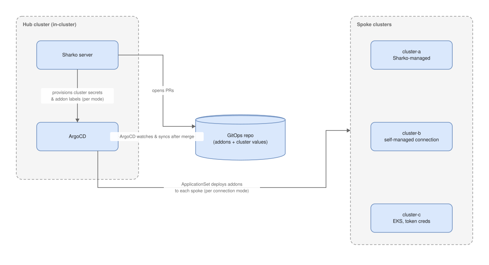

<p align="center">
  
</p>

<h1 align="center">Sharko</h1>

<p align="center">
  <strong>Addon management for Kubernetes clusters, built on ArgoCD</strong>
</p>

<p align="center">
  <a href="https://github.com/MoranWeissman/sharko/releases"></a>
  <a href="https://github.com/MoranWeissman/sharko/blob/main/LICENSE"></a>
  <a href="https://github.com/MoranWeissman/sharko/actions/workflows/ci.yml"></a>
  <a href="https://sharko.readthedocs.io/"></a>
</p>

---

> **Sharko v4.0.0 is a technical preview. Do not use Sharko in production.** Install only published `v4.0.0`-or-later artifacts. `v3.0.0`, the only public release so far, and every earlier tag remain retired and unsupported — it is unsafe, so **do not install it**. There is no patch for the `v3` line. See [SECURITY.md](SECURITY.md#why-v300-is-retired) for what went wrong. Sharko follows [semantic versioning](https://semver.org/) and an [API stability contract](docs/site/developer-guide/api-stability.md): breaking changes only land in MAJOR version bumps.

> **Sharko is a technical preview, not production ready.** There are no *known* credential leaks, permission bypasses, or places where Sharko says work finished when it did not — but nobody outside this project has assessed its security, the activity history is lost on every restart, and only one copy of Sharko can run at a time. Read [Technical preview — read this before you point Sharko at a cluster](docs/site/technical-preview.md) before you give it real cluster credentials.

Full documentation: **https://sharko.readthedocs.io/**

**Sharko is a GitOps agent with an API: your portal or pipeline asks for "a cluster with these addons," and Sharko opens a pull request — every change to what runs on your cluster goes through a PR you review, never straight to your cluster behind your back.**

Sharko's deploy logic lives in one place: [`sharko-engine`](charts/sharko-engine), a versioned, signed Helm chart published next to the server image. Your repo pins one version of it; when Sharko ships new deploy logic, you get a small pin-bump PR to review, not a migration. Everything else in your repo is small, readable data files — no template logic to write or maintain. Your repo, Sharko's format: read it any time, write through Sharko.

Three doors lead to the same pipeline: the UI for a person, the REST API for a portal, Backstage, Terraform, or a pipeline acting on someone's behalf, and the CLI, which wraps that same API. All three do the same three things — validate, preview, then open a PR. **Sharko proposes, ArgoCD enforces:** Sharko doesn't deploy workloads — ArgoCD does that, by syncing from Git — but Sharko does manage the ArgoCD connection Secrets and addon secrets on your clusters. If you remove Sharko, everything ArgoCD deployed keeps running and syncing from Git.

Sharko is a server that runs in your Kubernetes cluster, next to ArgoCD. Install it with a single Helm command, and a guided wizard walks you through connecting your Git repo, ArgoCD instance, and optional secrets provider — no config files, no env vars to set by hand.

<p align="center">
  
</p>

## Why not just ApplicationSets?

Fair question — it's usually the first one ArgoCD users ask. If your platform team is comfortable with ApplicationSets, the app-of-apps pattern, and the public [gitops-bridge](https://github.com/gitops-bridge-dev/gitops-bridge) approach, you can build most of this yourselves: fleet-wide addon rollout, per-cluster values selected by labels on ArgoCD cluster secrets, Git as the source of truth. That's a legitimate choice, and Sharko doesn't replace that pattern — it sits on top of the exact same one.

What Sharko adds on top: a UI, REST API, and audit trail that people who *didn't* author the repo can use safely; a curated catalog with cosign-signed entries and OpenSSF Scorecard data; an upgrade advisor; and non-destructive adoption of an existing shared ArgoCD, joining as a guest, never taking ownership.

If DIY serves you well, keep it. Sharko is for teams who want that same pattern productized. For the full comparison — including where secret-delivery tools, GitOps promoters, and cluster-fleet managers fit — see [Sharko vs. the Alternatives](docs/site/user-guide/comparison.md).

## Features

- **Versioned engine, data-only repo** — the deploy logic ships as a signed Helm chart (`sharko-engine`) that your repo pins one version of; your repo itself holds only small, readable data files, never template logic
- **PR-gated writes through every door** — UI, API, and CLI all run the same validate → preview → open-a-PR pipeline; Sharko doesn't deploy workloads (ArgoCD does), though it does manage ArgoCD connection Secrets and addon secrets on your clusters
- **Fleet upgrades and version matrix** — see every addon's version across every cluster; upgrade recommendations flag security fixes and breaking changes before you commit to a version
- **Curated catalog with signed entries** — 45 vetted Helm addons, each cryptographically signed with [cosign](https://docs.sigstore.dev/cosign/overview/) and scored by the [OpenSSF Scorecard](https://securityscorecards.dev/) project
- **Secret sync** — deliver addon credentials to remote clusters via AWS Secrets Manager or Kubernetes Secrets, no External Secrets Operator required
- **No lock-in** — everything ArgoCD runs is rendered from your repo; remove Sharko and every addon keeps running and syncing. See [If you remove Sharko](docs/site/operator/removing-sharko.md)

<details>
<summary>Also includes</summary>

- **Wizard-based setup** — first run opens a step-by-step wizard: Git connection, ArgoCD connection, secrets provider, and repo initialization
- **Fleet dashboard** — cluster health cards with sync status, addon counts, and connection indicators; managed and discovered clusters in separate sections
- **Third-party catalogs** — operators extend the built-in catalog with internal or partner sources, either via `SHARKO_CATALOG_URLS` or a git-native `marketplace-sources.yaml`. If the same addon appears in both, the built-in entry wins.
- **Managed vs discovered clusters** — Sharko surfaces all ArgoCD clusters; adopt discovered clusters into full management in one click
- **API keys** — long-lived tokens for Backstage, Terraform, and CI/CD integrations
- **ArgoCD diagnostics** — ArgoCD connection state surfaced per cluster; bootstrap app health shown on dashboard and observability view
- **Auto-refresh** — dashboard, cluster detail, cluster overview, and addon detail pages refresh automatically (30s); addon catalog refreshes every 60s
- **Audit log** — every write operation recorded with actor, action, result, and timestamp; queryable via `GET /api/v1/audit`
- **Multi-cloud provider stubs** — interface stubs for GCP and Azure so contributors can fill in those providers without redesigning the secrets layer
- **End-to-end test framework** — test against a real ArgoCD + Kind cluster (`make test-e2e-fast` for a fast in-process pass, `make test-e2e` for the full kind-backed suite)

</details>

## Demo

No Kubernetes cluster required — mock backends simulate ArgoCD, Git, and secrets providers.

```bash
git clone https://github.com/MoranWeissman/sharko.git
cd sharko
make demo
```

Open [http://localhost:8080](http://localhost:8080) and log in with `admin` / `admin` (admin role) or `qa` / `sharko` (viewer role).

## Quick Start (Production)

> **Sharko v4.0.0 is a technical preview. Do not use Sharko in production.** Install only published `v4.0.0`-or-later artifacts. Do not install any Sharko chart version below `v4.0.0` — all earlier release lines are retired and unsupported. See [SECURITY.md](SECURITY.md#why-v300-is-retired).

### 1. Install Sharko

```bash
helm install sharko oci://ghcr.io/moranweissman/sharko/sharko \
  --namespace sharko --create-namespace
```

If using AWS Secrets Manager for cluster credentials, add the IAM Roles for Service Accounts (IRSA) annotation so the pod can assume an AWS role:

```bash
helm install sharko oci://ghcr.io/moranweissman/sharko/sharko \
  --namespace sharko --create-namespace \
  --set serviceAccount.annotations."eks\.amazonaws\.com/role-arn"=arn:aws:iam::000000000000:role/sharko-role
```

### 2. Get the Admin Password

On first start, Sharko prints the auto-generated admin password to stdout (visible in `kubectl logs`) and writes it to a dedicated Kubernetes Secret for later retrieval:

```bash
kubectl -n sharko get secret sharko-initial-admin-secret \
  -o jsonpath='{.data.password}' | base64 -d
```

The password is shown on stdout once at first start; the Secret retrieval works any time before the operator changes the admin password.

### 3. Open the UI

```bash
kubectl port-forward svc/sharko 8080:80 -n sharko
```

Open [http://localhost:8080](http://localhost:8080) and log in with `admin` and the password from step 2.

### 4. Complete the First-Run Wizard

The wizard appears automatically on first access — no separate configuration step needed.

1. **Welcome** — overview of what Sharko will set up
2. **Git connection** — enter your repo URL and personal access token
3. **ArgoCD connection** — Sharko auto-discovers the ArgoCD service in-cluster; add optional secrets provider config
4. **Initialize repository** — Sharko creates the ApplicationSet, base values, and cluster directory structure in your repo; choose auto-merge or review the PR yourself

After the wizard completes, the dashboard loads with clusters pulled from ArgoCD.

## Architecture

```
Developer laptop / CI:
  sharko CLI ---------> Sharko Server API

Backstage / Port.io / Terraform:
  plugin / curl ------> Sharko Server API

Sharko Server (in-cluster):
  +-- UI (React dashboard with first-run wizard)
  +-- API (REST endpoints, JWT + API key auth)
  +-- Orchestrator (workflow engine, Git-serialized via mutex)
  +-- ArgoCD client (service-discovery + account token auth)
  +-- Git client (GitHub, Azure DevOps, Gitea)
  +-- Secrets provider (AWS SM, K8s Secrets)
  +-- Remote client (deliver secrets to remote clusters)
  +-- AI assistant (optional, off by default)
  +-- Swagger UI (/swagger/index.html)
```

The server holds all credentials. The CLI is a thin HTTP client — like `kubectl` to the Kubernetes API. No credentials on developer laptops.

## Tech Stack

| Layer | Technology |
|-------|------------|
| Backend | Go 1.25, net/http, Cobra CLI framework |
| Frontend | React 18, TypeScript, Vite |
| Styling | Tailwind CSS v4, shadcn/ui components |
| GitOps | ArgoCD ApplicationSets, Helm charts |
| API docs | Swagger / OpenAPI (swag) |
| Secrets | AWS Secrets Manager, Kubernetes Secrets |
| AI (optional) | OpenAI, Claude, Gemini, Ollama, custom OpenAI-compatible |

## CLI Commands

| Command | Description |
|---------|-------------|
| `sharko login --server <url>` | Authenticate with the server |
| `sharko version` | Show CLI + server version |
| `sharko connect` | Configure the active Git connection |
| `sharko connect list` | Show current connection |
| `sharko connect test` | Test current connection |
| `sharko init` | Initialize the addons repo (async, streams progress) |
| `sharko validate [path]` | Validate catalog YAML against schema |
| `sharko add-cluster <name>` | Register a cluster |
| `sharko add-clusters <n1,n2,...>` | Batch register multiple clusters |
| `sharko remove-cluster <name>` | Deregister a cluster |
| `sharko update-cluster <name>` | Update addon assignments |
| `sharko list-clusters` | List all clusters |
| `sharko test-cluster <name>` | Test connectivity to a cluster |
| `sharko adopt <cluster1> [cluster2] ...` | Adopt one or more discovered ArgoCD clusters |
| `sharko add-addon <name>` | Add addon to catalog |
| `sharko remove-addon <name>` | Remove addon (dry-run without `--confirm`) |
| `sharko upgrade-addon <name>` | Upgrade an addon version |
| `sharko upgrade-addons <addon=ver,...>` | Batch upgrade multiple addons |
| `sharko list-addons [--show-config]` | List addons |
| `sharko refresh-secrets [cluster]` | Trigger immediate secrets reconcile |
| `sharko secret-status` | Show addon-secret sync status per cluster |
| `sharko token create` | Create an API key |
| `sharko token list` | List API keys |
| `sharko token revoke <name>` | Revoke an API key |
| `sharko status` | Cluster status overview |

This is a starting-point list, not the full command set — see the [CLI Reference](docs/site/cli/commands.md) for every command and flag.

## API

Sharko exposes a REST API that every consumer uses — the CLI, the UI, and external integrations. A few representative endpoints:

| Method | Path | Description |
|--------|------|-------------|
| GET | `/api/v1/clusters` | List clusters with health stats |
| GET | `/api/v1/clusters/{name}/comparison` | Git vs ArgoCD comparison, including ArgoCD connection state |
| GET | `/api/v1/addons/version-matrix` | Version matrix: addon × cluster grid |
| GET | `/api/v1/upgrade/{addonName}/recommendations` | Upgrade recommendations (next patch, next minor, latest stable) |
| GET | `/api/v1/audit` | Audit log: actor, action, result, timestamp |
| POST | `/api/v1/clusters` | Register a cluster |
| POST | `/api/v1/clusters/adopt` | Adopt one or more discovered ArgoCD clusters |
| PATCH | `/api/v1/clusters/{name}` | Update a cluster's addon assignments |
| POST | `/api/v1/addons` | Add an addon to the catalog |
| POST | `/api/v1/addons/{name}/upgrade` | Upgrade an addon |
| POST | `/api/v1/init` | Initialize the addons repo (async — returns `operation_id`) |

This is a sample, not the full surface — see the [API Reference](docs/site/api/overview.md) (OpenAPI/Swagger-generated) for every endpoint and its request/response shape, or the interactive docs at `/swagger/index.html` on a running server.

## Settings

After the wizard, **Settings** groups into a few areas: connection (Git + ArgoCD), secrets provider, GitOps (auto-merge, branch/commit prefixes), your own account, and — for admins — user management, API keys, catalog sources, and platform-level switches like the AI provider and the addon values engine's on/off toggle.

## AI Assistant (optional)

Sharko includes an optional assistant that is opt-in and off by default — no assistant UI appears until you configure an AI provider (OpenAI, Claude, Gemini, Ollama, or any OpenAI-compatible API) in **Settings → AI**.

## Secrets Provider

Sharko uses a pluggable provider to fetch cluster kubeconfigs:

| Provider | Description |
|----------|-------------|
| `aws-sm` | AWS Secrets Manager. Auth via IAM Roles for Service Accounts (IRSA) — no static credentials. |
| `k8s-secrets` | Kubernetes Secrets (no cloud dependency) |

Configure in **Settings → Secrets Provider**. Supports structured JSON secrets in AWS Secrets Manager (individual keys instead of raw kubeconfig YAML) and EKS token generation via IRSA + STS.

## Development

For local secrets (Git token, AI provider keys), copy `secrets.env.example` to `secrets.env` and fill in the values.

### Demo mode

```bash
make demo
# Open http://localhost:8080 — login: admin/admin or qa/sharko
```

### Hot-reload development

```bash
make dev
# Frontend: http://localhost:5173
# Backend:  http://localhost:8080 (API only)
```

### Build and test

```bash
make build    # Build Go binary + UI
make test     # Run all tests (Go + UI)
make lint     # Go vet + UI build check
```

### Swagger regeneration

```bash
swag init -g cmd/sharko/serve.go -o docs/swagger --parseDependency --parseInternal
```

## Documentation

The full documentation site is at **https://sharko.readthedocs.io/**:

| Document | Description |
|----------|-------------|
| [Getting Started](docs/site/getting-started/quickstart.md) | Quick start: install, first run, wizard walkthrough |
| [User Guide](docs/site/user-guide/why-sharko.md) | Day-to-day guide: connections, clusters, addons, upgrades, drift detection |
| [Operator Manual](docs/site/operator/installation.md) | Install, configure, and run Sharko in production |
| [API Reference](docs/site/api/overview.md) | Full API reference: endpoints, request/response shapes, and the OpenAPI spec |
| [Architecture](docs/site/architecture/overview.md) | Server-first architecture, orchestrator pattern, provider interfaces |
| [Developer Guide](docs/site/developer-guide.md) | Project structure, coding patterns, testing, adding new features |

The legacy `docs/api-contract.md`, `docs/architecture.md`, `docs/user-guide.md`, and `docs/developer-guide.md` files remain in the repo as raw reference only — the docs site above is the maintained version.

## Community

Sharko is an open project that follows CNCF-style governance and community conventions — public governance, DCO sign-off, a code of conduct, and a security disclosure policy. Contributions, adopters, and feedback are all welcome.

| Resource | Description |
|----------|-------------|
| [CONTRIBUTING.md](CONTRIBUTING.md) | How to file issues, open PRs, run tests, and sign your commits (DCO) |
| [CODE_OF_CONDUCT.md](CODE_OF_CONDUCT.md) | Contributor Covenant v2.1 — our community standards |
| [GOVERNANCE.md](GOVERNANCE.md) | Project governance, decision-making, and the BDFL → steering-committee transition plan |
| [MAINTAINERS.md](MAINTAINERS.md) | Current maintainers and how to become one |
| [SECURITY.md](SECURITY.md) | Responsible security disclosure process |
| [Threat Model](docs/design/2026-08-08-threat-model-v4.md) | The v4 threat model: how a secret value moves through Sharko, the checks that guard it, what permissions Sharko holds, and what's honestly not built yet |
| [ADOPTERS.md](ADOPTERS.md) | Organizations using Sharko — add yours! |

GitHub Discussions is not turned on for this repo yet, so for now, project Q&A, design discussion, bug reports, and feature requests all go through the [issue tracker](https://github.com/MoranWeissman/sharko/issues/new/choose). For security issues, follow [SECURITY.md](SECURITY.md) — please do not file security reports as public issues.

This project is built with the help of AI coding agents — see [Developing with AI](docs/site/developer-guide/developing-with-ai.md) and [CONTRIBUTING.md](CONTRIBUTING.md#ai-agent-collaborators). The AI workflow skills under `.claude/skills/bmad-*` come from the [BMAD-METHOD](https://github.com/bmad-code-org/BMAD-METHOD) project (MIT license, BMad Code, LLC) — see [THIRD-PARTY-NOTICES.md](THIRD-PARTY-NOTICES.md).

## License

[Apache-2.0](LICENSE)
