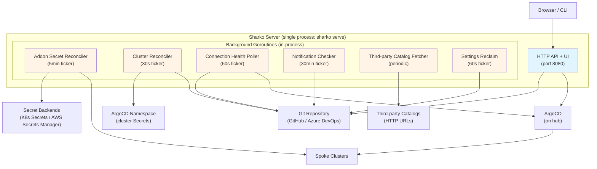
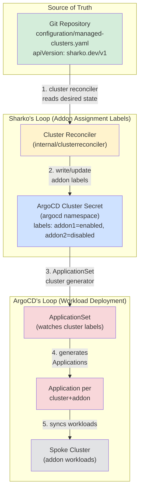
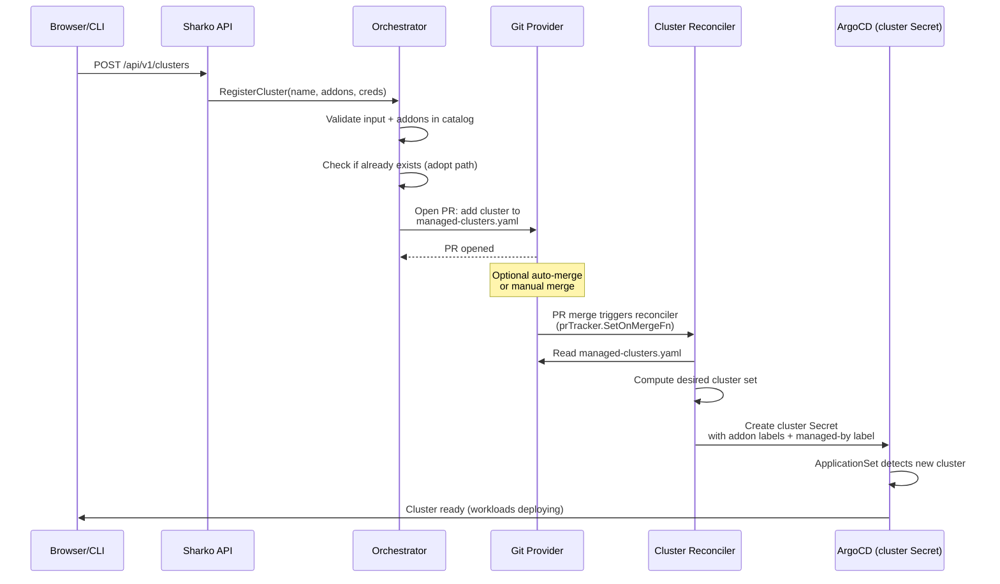
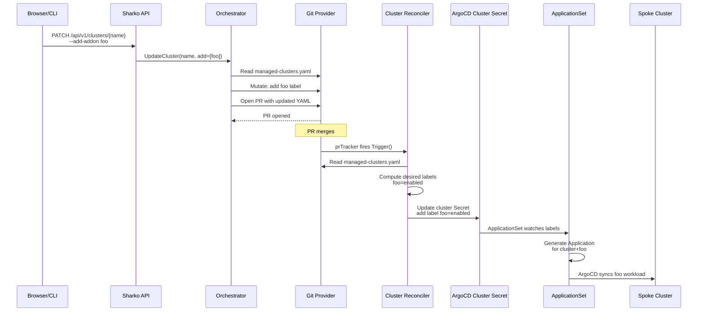
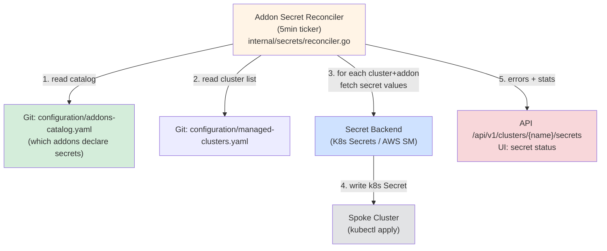
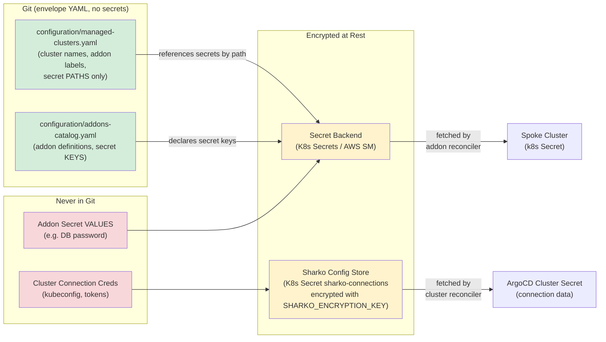

# Sharko Current-State Architecture

Sharko is a hub-and-spoke addon management server for Kubernetes clusters, built on ArgoCD. It runs as a single binary serving one HTTP process. The hub (Sharko + ArgoCD) manages addons on spoke clusters without ever owning cluster registration or secret rotation in the traditional ClickOps sense — instead, Git is the source of truth, ArgoCD is the workload deployer, and Sharko is a guest that orchestrates through labels and PRs.

## System Component View



**Critical architecture fact:** The entire diagram above represents ONE binary running as ONE server process. The "reconcilers" are in-process goroutines with ticker loops inside that one `sharko serve` process — NOT separate controllers, NOT a second server. Each reconciler is started via a `Start()` call in `cmd/sharko/serve.go` that launches a goroutine with a `time.Ticker`, and stopped via a deferred `Stop()` on shutdown.

## The Two GitOps Loops

Sharko's architecture is built around TWO distinct GitOps loops operating on different objects, driven by ONE source of truth (Git).



**Key truths:**

1. **Sharko's loop:** Git (`cluster-addons.yaml`) → Sharko's cluster reconciler → the addon-assignment LABELS on the ArgoCD cluster Secret in the `argocd` namespace.
2. **ArgoCD's loop:** Those labels → ApplicationSet cluster generator → Application resources → addon WORKLOADS on the spoke.
3. **Sharko NEVER deploys workloads.** It only writes labels. ArgoCD owns the workload-to-cluster sync.

## Register a Cluster Flow



**Important:** The cluster reconciler is the ONLY writer of the ArgoCD cluster Secret during register. The orchestrator never writes to the `argocd` namespace directly — it only writes to Git (PR), then triggers the reconciler post-merge.

## Add an Addon to a Cluster Flow



**Key points:**

1. Every addon change = a PR to Git.
2. The `prTracker` observes PR merges and calls `clusterRecon.Trigger()` for sub-5s convergence.
3. The cluster reconciler reads Git and writes the label onto the cluster Secret.
4. ArgoCD's ApplicationSet reacts to the label change and deploys the workload.

## Addon Secret Reconcile Flow

Sharko writes addon secret VALUES directly onto remote clusters in-process. There is no ESO (External Secrets Operator) or CRD-based desired-state today — the reconciler reads the addon catalog and pushes secrets imperatively.



**Observability:** Errors and status are exposed via:

- `GET /api/v1/clusters/{name}/secrets` (API endpoint)
- The UI secret-status widget
- `GET /api/v1/audit` (audit log shows `secret_push` events)
- K8s events emitted by the reconciler (when in-cluster)

There is NO `kubectl`-native desired-state object today (no CRD, no Secret with a Sharko annotation tracking drift). The reconciler pushes imperatively; errors surface via the audit log and API only.

## Secrets and Credentials: Where They Live



**Important truths:**

1. Git NEVER holds secret values — only paths/references (e.g., `secret_path: aws-sm:prod-db-password`).
2. Cluster connection credentials are encrypted in the Sharko config store (`sharko-connections` K8s Secret, encrypted with `SHARKO_ENCRYPTION_KEY`).
3. Addon secret values live in the configured secret backend (K8s Secrets / AWS Secrets Manager).
4. The addon-secret reconciler fetches values from the backend and pushes them directly to spoke clusters in-process.

## Envelope Structure and Schema

Every Sharko-owned YAML file in Git ships with an envelope:

```yaml
apiVersion: sharko.dev/v1  # Current (legacy: sharko.io/v1 for backward compat)
kind: ManagedClusters       # or AddonCatalog, MarketplaceSources, DefaultAddons
metadata:
  name: managed-clusters    # Identifies the resource
spec:
  clusters:                 # The actual payload
    - name: prod-us
      labels:
        addon1: enabled
```

**Schema validation:** Every file is validated against a committed JSON Schema (`docs/schemas/*.v1.json`) BEFORE being unmarshalled. CI gates (`schemas-up-to-date`, `validate-sharko-config`) keep the schema and YAML samples in lockstep. The validation happens in `internal/schema/envelope.go` (`DefaultValidator`) using `santhosh-tekuri/jsonschema v5`.

**Source of truth:** `internal/schema/envelope.go` line 44 defines:

```go
const APIVersion = "sharko.dev/v1"
const APIVersionLegacy = "sharko.io/v1"  // Backward compatibility
```

## What's NOT Here Today

Sharko is NOT an operator. There is no CRD, no second binary, and no kubectl-native desired-state object for addon secrets or cluster registrations. Key gaps:

- **No CRD for desired state:** The addon-secret reconciler reads Git + pushes imperatively. There is no Secret with a `sharko.dev/secret: desired` annotation that lets an operator `kubectl get` the desired state and compare it to the live Secret.
- **No per-object status:** Addon secret errors surface via the audit log and `GET /api/v1/audit`, not as a `.status` field on a CRD.
- **Cluster registration is GitOps-shaped but not CRD-based:** The reconciler reads `managed-clusters.yaml` (a file in Git), not a `ManagedCluster` CR in the `sharko` namespace.
- **One process, not a controller manager:** `sharko serve` is one HTTP server with background goroutines. There is no separate `sharko-controller-manager` binary.

This is a design choice (API-first, not operator-first), stated neutrally for a future operator-design discussion.

## Background Goroutines (Reconcilers and Pollers)

All started in `cmd/sharko/serve.go` line ~118-1225:

| Goroutine | Default Interval | Purpose | Triggered By |
|-----------|-----------------|---------|--------------|
| **Addon Secret Reconciler** | 5 min (`SHARKO_SECRET_RECONCILE_INTERVAL`) | Pushes addon secret values to spoke clusters | Timer + webhook trigger + `Trigger()` call |
| **Cluster Reconciler** | 30 sec (safety net) | Writes ArgoCD cluster Secrets from Git (sole writer as of v3.0.0) | Timer + `prTracker.SetOnMergeFn` (sub-5s post-merge) |
| **Connection Poller** | 60 sec (`SHARKO_CONNECTION_CHECK_INTERVAL`) | Probes Sharko→Git and ArgoCD→repo health | Timer |
| **Notification Checker** | 30 min | Checks for addon upgrades, drift, security advisories | Timer |
| **Third-party Catalog Fetcher** | Configurable (`refresh_interval` in config) | Fetches + verifies third-party addon catalogs | Timer |
| **Settings Reclaim** | 60 sec (`SHARKO_SETTINGS_RECONCILE_INTERVAL`) | Reclaims runtime API edits on git-declared keys (git wins) | Timer |
| **PR Tracker** | Polls Git provider for PR status | Tracks open PRs, emits audit events, triggers reconcilers on merge | Timer |

**Key pattern:** Each reconciler is a `sync.Once` started goroutine with a `time.Ticker` select loop. The `Trigger()` method is a non-blocking channel send (buffered chan with len=1) that requests an immediate run. The loop looks like:

```go
for {
    select {
    case <-ticker.C:
        r.reconcile()  // periodic tick
    case <-r.triggerCh:
        r.reconcile()  // immediate trigger
    case <-r.stopCh:
        return         // shutdown
    }
}
```

This is the same pattern across `internal/secrets/reconciler.go`, `internal/clusterreconciler/reconciler.go`, and `internal/prtracker/tracker.go`.

## Contradictions with architect.md

1. **Envelope apiVersion:** `architect.md` line 90 says `sharko.io/v1`. The CODE says `sharko.dev/v1` is canonical (with `sharko.io/v1` as a legacy fallback for backward compat). The real apiVersion is **`sharko.dev/v1`**.
2. **Single reconciler writer:** As of v3.0.0, `internal/clusterreconciler` is the SOLE writer of ArgoCD cluster Secrets. The legacy 3-minute `argosecrets.Reconciler` loop was retired. The `argosecrets.Manager` (the pure CRUD writer for kubeconfig direct-writes, used by the canonical reconciler and by orchestrator direct-write paths) remains.

## Summary

Sharko is:

- **One binary, one process (`sharko serve`)** with in-process background goroutines (reconcilers).
- **Two GitOps loops:** Sharko writes labels on ArgoCD cluster Secrets (from Git), ArgoCD writes workloads on spokes (from those labels).
- **Guest-not-owner:** Sharko + ArgoCD run on the hub. ArgoCD owns the spoke connections. Sharko is a guest that orchestrates through labels.
- **PR-only write flow:** Every Git change = a PR (optional auto-merge). The `prTracker` triggers reconcilers on merge for sub-5s convergence.
- **Two secret paths, both in-process TODAY:** Addon secret values (reconciler → spoke) and cluster connection creds (stored encrypted, read by reconciler). No ESO, no CRD.
- **Envelope + schema validation:** Every file is `apiVersion: sharko.dev/v1` (or legacy `sharko.io/v1`) + validated against committed JSON Schemas before parse.

This doc is 100% grounded in the code as of the read. It becomes the input to a future operator-design session AND a public trust signal for the first v3.0.0 release.
