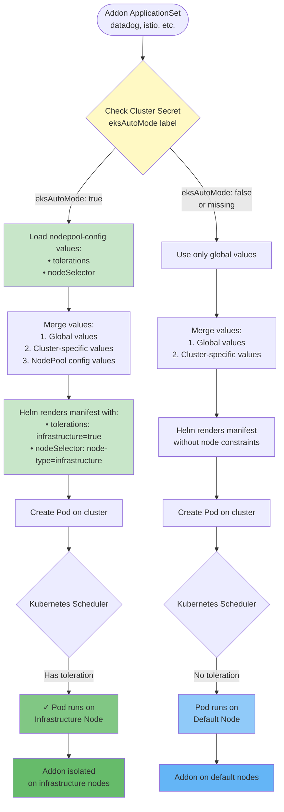
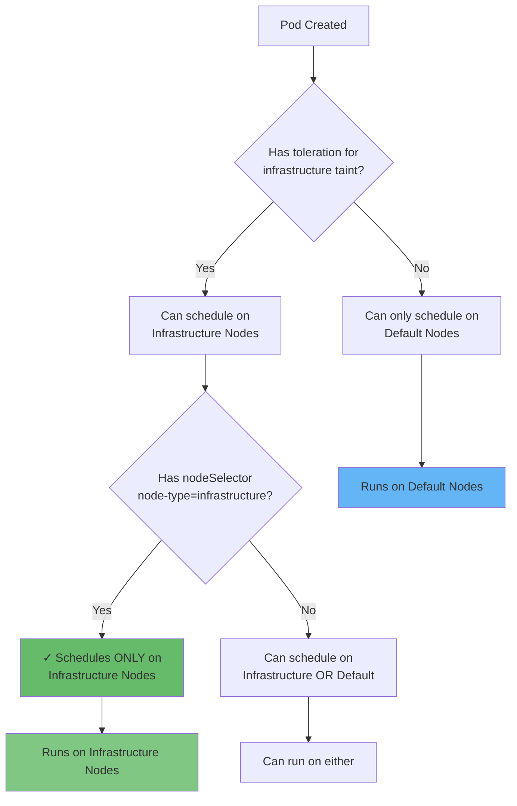

# Addon Deployment Flow with Infrastructure Node Separation

**Purpose:** Shows how addons are automatically configured to run on infrastructure nodes when `eksAutoMode: true`.

**Audience:** Technical - Understands ArgoCD ApplicationSets, Helm, Kubernetes scheduling

**Key Points:**
- Addon ApplicationSet checks cluster label
- Conditionally loads nodepool-config values file
- Helm renders with tolerations + nodeSelector
- Pod scheduled only on infrastructure nodes

## Flow Diagram



## Detailed Component Flow

### 1. ApplicationSet Configuration

**Addon ApplicationSet (e.g., datadog):**
```yaml
apiVersion: argoproj.io/v1alpha1
kind: ApplicationSet
metadata:
  name: datadog
spec:
  goTemplate: true
  generators:
    - matrix:
        generators:
          - clusters:
              selector:
                matchLabels:
                  datadog: enabled  # Cluster must enable addon
          - git:
              files:
                - path: "configuration/addons-clusters-values/{{.name}}.yaml"
  template:
    spec:
      sources:
        - repoURL: https://helm.datadoghq.com
          chart: datadog
          helm:
            valueFiles:
              # Global values (always loaded)
              - '$values/configuration/addons-global-values/datadog.yaml'

              # Conditional: load nodepool-config if eksAutoMode=true
              - '{{if eq (index .metadata.labels "eksAutoMode") "true"}}$values/configuration/addons-global-values/nodepools-config-values/datadog-nodepool-config.yaml{{end}}'

            ignoreMissingValueFiles: true
```

### 2. NodePool Config Values File

**File:** `configuration/addons-global-values/nodepools-config-values/datadog-nodepool-config.yaml`

```yaml
# Datadog agent pods
agents:
  nodeSelector:
    node-type: infrastructure
  tolerations:
    - key: infrastructure
      operator: Equal
      value: "true"
      effect: NoSchedule
  resources:
    requests:
      cpu: 200m
      memory: 256Mi
    limits:
      cpu: 200m
      memory: 256Mi

# Datadog cluster agent
clusterAgent:
  nodeSelector:
    node-type: infrastructure
  tolerations:
    - key: infrastructure
      operator: Equal
      value: "true"
      effect: NoSchedule
  resources:
    requests:
      cpu: 100m
      memory: 128Mi
    limits:
      cpu: 100m
      memory: 128Mi
```

### 3. Helm Values Precedence

```
Lowest  → Global values (datadog.yaml)
        ↓
        → Cluster-specific values (cluster-name.yaml)
        ↓
Highest → NodePool config values (datadog-nodepool-config.yaml)
```

**Result:** NodePool config overrides global defaults, ensuring tolerations always applied for Auto Mode clusters.

### 4. Pod Manifest Result (Helm Rendered)

**With eksAutoMode=true:**
```yaml
apiVersion: apps/v1
kind: DaemonSet
metadata:
  name: datadog-agent
spec:
  template:
    spec:
      # NodeSelector targets infrastructure nodes
      nodeSelector:
        node-type: infrastructure

      # Tolerations allow scheduling on tainted nodes
      tolerations:
        - key: infrastructure
          operator: Equal
          value: "true"
          effect: NoSchedule

      containers:
        - name: agent
          image: datadog/agent:latest
          resources:
            requests:
              cpu: 200m
              memory: 256Mi
```

**Without eksAutoMode (default):**
```yaml
apiVersion: apps/v1
kind: DaemonSet
metadata:
  name: datadog-agent
spec:
  template:
    spec:
      # No nodeSelector - can run on any node
      # No tolerations - cannot run on tainted nodes
      containers:
        - name: agent
          image: datadog/agent:latest
```

### 5. Kubernetes Scheduling Decision



**Key Insight:**
- **Toleration alone** = "I can tolerate the taint" (pod can schedule there but isn't required to)
- **Toleration + nodeSelector** = "I must run there" (pod required to schedule on those nodes)

Our configuration uses **both** for guaranteed placement on infrastructure nodes.

## Value Files Loaded (Example: datadog on cluster "my-cluster")

### Scenario 1: EKS Auto Mode Cluster (eksAutoMode: true)

```
1. configuration/addons-global-values/datadog.yaml
   ↓ (merged with)
2. configuration/addons-clusters-values/my-cluster.yaml (datadog section)
   ↓ (merged with)
3. configuration/addons-global-values/nodepools-config-values/datadog-nodepool-config.yaml
   ↓ (result)
   Pod has tolerations + nodeSelector → runs on infrastructure nodes
```

### Scenario 2: Standard EKS Cluster (eksAutoMode: false or missing)

```
1. configuration/addons-global-values/datadog.yaml
   ↓ (merged with)
2. configuration/addons-clusters-values/my-cluster.yaml (datadog section)
   ↓ (result)
   Pod has no node constraints → runs on default nodes
```

## Verification Commands

```bash
# 1. Check if addon loaded nodepool-config values
kubectl get application datadog-my-cluster -n argocd -o yaml | grep nodepool-config

# 2. Verify pod has tolerations
kubectl get pods -n datadog -o yaml | grep -A 5 tolerations

# 3. Verify pod has nodeSelector
kubectl get pods -n datadog -o yaml | grep -A 2 nodeSelector

# 4. Check which nodes pods are running on
kubectl get pods -n datadog -o wide

# 5. Verify nodes have infrastructure label
kubectl get nodes -l node-type=infrastructure
```

## Complete Example: Datadog Deployment

```bash
# Cluster has eksAutoMode: true label
$ kubectl get secret my-cluster -n argocd -o jsonpath='{.metadata.labels.eksAutoMode}'
true

# ApplicationSet detects label and loads nodepool-config
$ kubectl get application datadog-my-cluster -n argocd -o yaml
spec:
  sources:
    - helm:
        valueFiles:
          - $values/.../datadog.yaml
          - $values/.../datadog-nodepool-config.yaml  # ← Loaded!

# Resulting pods have tolerations
$ kubectl get pods -n datadog -o yaml | grep -A 5 tolerations
tolerations:
  - key: infrastructure
    operator: Equal
    value: "true"
    effect: NoSchedule

# Pods scheduled only on infrastructure nodes
$ kubectl get pods -n datadog -o wide
NAME              NODE
datadog-agent-abc ip-10-0-1-123.ec2.internal  # ← Infrastructure node
datadog-agent-xyz ip-10-0-2-234.ec2.internal  # ← Infrastructure node
```

## Integration Points

| Component | Purpose | Configuration |
|-----------|---------|---------------|
| **Cluster Secret Label** | Trigger for conditional loading | `eksAutoMode: "true"` |
| **ApplicationSet** | Detects label, loads config | `{{if eq .metadata.labels.eksAutoMode "true"}}` |
| **NodePool Config File** | Contains tolerations/nodeSelector | `datadog-nodepool-config.yaml` |
| **Helm Values Merge** | Combines all value sources | Precedence: NodePool > Cluster > Global |
| **Pod Spec** | Rendered with node constraints | `tolerations + nodeSelector` |
| **Kubernetes Scheduler** | Places pod on infrastructure node | Matches toleration + label |

## Adding New Addon to Infrastructure Nodes

To add a new addon to infrastructure nodes:

1. **Create nodepool-config values file:**
   ```bash
   touch configuration/addons-global-values/nodepools-config-values/my-addon-nodepool-config.yaml
   ```

2. **Add tolerations and nodeSelector:**
   ```yaml
   controller:
     nodeSelector:
       node-type: infrastructure
     tolerations:
       - key: infrastructure
         operator: Equal
         value: "true"
         effect: NoSchedule
     resources:  # IMPORTANT: Always define
       requests:
         cpu: 100m
         memory: 128Mi
   ```

3. **Enable addon on Auto Mode cluster:**
   ```yaml
   # cluster-addons.yaml
   clusters:
     - name: my-cluster
       labels:
         my-addon: enabled  # Will automatically use infra nodes if eksAutoMode: true
   ```

4. **Verify:**
   ```bash
   kubectl get pods -n my-addon -o wide
   # Should see pods on infrastructure nodes
   ```

That's it! The ApplicationSet automatically loads the nodepool-config file when `eksAutoMode: true`.
