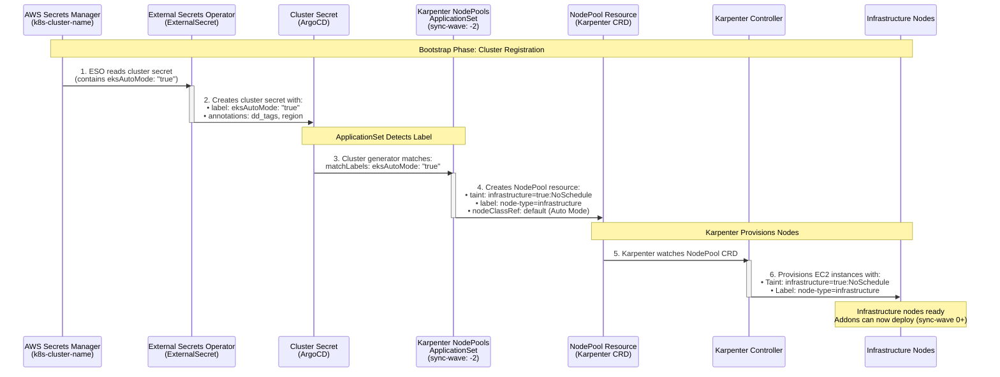

# NodePool Creation Flow for EKS Auto Mode Clusters

**Purpose:** Shows the sequence and timing of how infrastructure NodePools are automatically deployed to clusters with `eksAutoMode: true`.

**Audience:** Technical - Understands ArgoCD, Kubernetes, ESO

**Key Points:**
- Sync-wave -2 ensures NodePools exist before addons
- ESO reads from AWS Secrets Manager and creates cluster secret
- ApplicationSet uses cluster generator with label matching
- Karpenter provisions nodes based on NodePool resource

## Sequence Diagram



## Key Technical Details

### 1. AWS Secrets Manager Secret Format
```json
{
  "name": "my-cluster",
  "host": "https://...",
  "clusterName": "my-cluster",
  "accountId": "123456789012",
  "region": "eu-west-1",
  "caData": "...",
  "eksAutoMode": "true"
}
```

### 2. Cluster Secret Result (ESO creates)
```yaml
apiVersion: v1
kind: Secret
metadata:
  name: my-cluster
  namespace: argocd
  labels:
    argocd.argoproj.io/secret-type: cluster
    eksAutoMode: "true"  # ← Triggers NodePool ApplicationSet
  annotations:
    dd_tags: "env:dev,project:my-project"
    region: "eu-west-1"
```

### 3. ApplicationSet Cluster Generator
```yaml
apiVersion: argoproj.io/v1alpha1
kind: ApplicationSet
metadata:
  name: karpenter-nodepools
  annotations:
    argocd.argoproj.io/sync-wave: "-2"  # Before all addons
spec:
  generators:
    - clusters:
        selector:
          matchLabels:
            argocd.argoproj.io/secret-type: cluster
            eksAutoMode: "true"  # ← Matches label from step 2
```

### 4. NodePool Resource Created
```yaml
apiVersion: karpenter.sh/v1
kind: NodePool
metadata:
  name: infra-karpenter-nodepool
spec:
  template:
    metadata:
      labels:
        node-type: infrastructure
    spec:
      nodeClassRef:
        name: default  # EKS Auto Mode managed
      taints:
        - key: infrastructure
          effect: NoSchedule
          value: "true"
      requirements:
        - key: node-type
          operator: In
          values: ["infrastructure"]
```

### 5. Infrastructure Nodes Result
```bash
$ kubectl get nodes -l node-type=infrastructure
NAME                          STATUS   ROLES    AGE   VERSION
ip-10-0-1-123.ec2.internal   Ready    <none>   5m    v1.31.0
ip-10-0-2-234.ec2.internal   Ready    <none>   5m    v1.31.0

$ kubectl get nodes -l node-type=infrastructure -o jsonpath='{.items[0].spec.taints}'
[{"effect":"NoSchedule","key":"infrastructure","value":"true"}]
```

## Sync Wave Importance

```
Wave -2: Karpenter NodePools ApplicationSet
         ↓
         NodePool resource created
         ↓
         Karpenter provisions infrastructure nodes
         ↓
         Infrastructure nodes ready
         ↓
Wave 0+: Addon ApplicationSets deploy
         ↓
         Addons scheduled on infrastructure nodes
```

**Why sync-wave -2 matters:**
- Ensures NodePool exists before any addon tries to deploy
- Addons can immediately schedule on infrastructure nodes
- No race condition between NodePool creation and addon deployment

## Verification Commands

```bash
# 1. Check ApplicationSet created Application
kubectl get application karpenter-nodepools-my-cluster -n argocd

# 2. Check NodePool resource exists on remote cluster
kubectl get nodepool --context my-cluster

# 3. Verify infrastructure nodes provisioned
kubectl get nodes -l node-type=infrastructure --context my-cluster

# 4. Check node taints
kubectl get nodes -l node-type=infrastructure --context my-cluster \
  -o jsonpath='{.items[*].spec.taints}'
```
