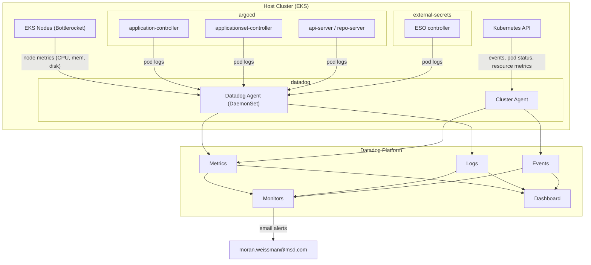

# Host Cluster Monitoring

Datadog monitoring for the ArgoCD management cluster (`devops-argocd-addons-*-eks`) —
the single control plane for deploying and managing addons across 50+ EKS clusters.

**Coverage:** Kubernetes infrastructure (nodes, pods, resources, events) for `argocd`,
`external-secrets`, and `kube-system` namespaces.

---

## Architecture

---

## Monitored Scope

| Namespace | Components | Why Critical |
|-----------|------------|--------------|
| `argocd` | application-controller, applicationset-controller, api-server, repo-server | Controls sync across 50+ clusters |
| `external-secrets` | ESO controller, webhook | Bootstrap secret delivery for all clusters |
| `kube-system` | System pods (events + restart monitoring only) | Cluster infrastructure stability |

EKS control plane components (kube-apiserver, etc.) are AWS-managed and not visible as pods.
Node-level monitoring covers the underlying EC2 infrastructure.

---

## Dashboard

**Name:** "ArgoCD Cluster Addons Host Cluster"
**CRD:** `monitoring/crds/dashboard-host-cluster.yaml`
**Template variables:** `$cluster_name`, `$namespace`, `$env`

| Section | Panels |
|---------|--------|
| Node Health | Nodes Ready, avg CPU/Memory/Disk, resource timeseries per node |
| Core Components | Table: CPU, memory, restarts per component (`argocd`, `external-secrets`) |
| Pod Health | Running/Pending/Failed/CrashLoop counts, restart timeseries (last 24h) |
| Kubernetes Events | Live warning event stream |
| Resource Utilization | CPU and Memory: usage vs requests vs limits (cluster total) |

---

## Monitors

8 active monitors, all tagged `component:argocd-cluster-addons-host`.

**JSON exports:** `monitoring/monitors/host-cluster/` | **CRD examples:** `monitoring/crds/monitors/`

| Monitor | Priority | Threshold | Scope |
|---------|----------|-----------|-------|
| ArgoCD application-controller pod down | P1 | `replicas_ready < 1` | `kube_namespace:argocd` |
| ArgoCD applicationset-controller pod down | P1 | `replicas_available < 1` | `kube_namespace:argocd` |
| Node NotReady | P1 | `node_status{false} >= 1` | All nodes |
| Node disk utilization | P2/P1 | `> 75% / > 85%` | `kube_cluster_name:devops-argocd-addons-*` |
| Node memory utilization | P2/P1 | `> 80% / > 90% used` | `kube_cluster_name:devops-argocd-addons-*` |
| Container restart rate | P2/P1 | `> 3 / > 5 restarts in 15m` | `argocd`, `external-secrets`, `kube-system` |
| Component CPU utilization | P2/P1 | `> 80% / > 95% of limit` | `argocd`, `external-secrets` |
| Component memory utilization | P2/P1 | `> 80% / > 90% of limit` | `argocd`, `external-secrets` |

### Technical Notes

**Node NotReady — `on_missing_data: default`:** The metric `kubernetes_state.node.status{condition:ready,status:false}` only emits data when a node IS NotReady. No data = all nodes healthy. Using `show_and_notify_no_data` causes false alerts.

**StatefulSet tag name:** Datadog uses `kube_stateful_set` (with underscore), not `kube_statefulset`. The application-controller query filters on `kube_stateful_set:argocd-*-application-cont*`.

**Bottlerocket `/dev/root` exclusion:** EKS Auto Mode nodes run Bottlerocket OS. `/dev/root` is the immutable OS partition (~410MB, always 100% full by design). Excluded with `!device:/dev/root` to prevent permanent false alerts.

**Memory threshold direction:** `system.mem.pct_usable` returns the *available* fraction (0–1). Alert fires when it drops **below** the threshold: `< 0.10` = 90% used, `< 0.20` = 80% used.

**Working set vs usage:** Component memory monitor uses `kubernetes.memory.working_set` (not `usage`) — it reflects memory that cannot be reclaimed under pressure, which is the value the kernel uses for OOMKill decisions.

### Deferred Monitors

Two monitors pending ArgoCD OpenMetrics scraping setup:

| Monitor | Metric |
|---------|--------|
| ArgoCD app controller queue depth | `argocd_app_controller_queue_depth` |
| ArgoCD reconciliation duration (p95) | `argocd_app_reconcile_duration_seconds` |

---

## Tooling

Monitors and dashboard are managed as **DatadogMonitor / DatadogDashboard CRDs** via GitOps
(ArgoCD + Datadog Operator v1.6+). The operator reconciles CRD changes into the Datadog API.

See `monitoring/README.md` for GitOps workflow, prerequisites, and CRD vs JSON format differences.

---

## Notification Routing

| Recipient | Channel | Trigger |
|-----------|---------|---------|
| `moran.weissman@msd.com` | Email | All monitors |

Datadog email routing: `@moran.weissman@msd.com` in the monitor message body.

---

## References

- **Monitor JSON exports:** `monitoring/monitors/host-cluster/`
- **CRD examples (future):** `monitoring/crds/monitors/`
- **Dashboard CRD example (future):** `monitoring/crds/dashboard-host-cluster.yaml`
- **Operations guide:** `monitoring/README.md`
- [Datadog Operator — DatadogMonitor CRD](https://docs.datadoghq.com/containers/datadog_operator/)
