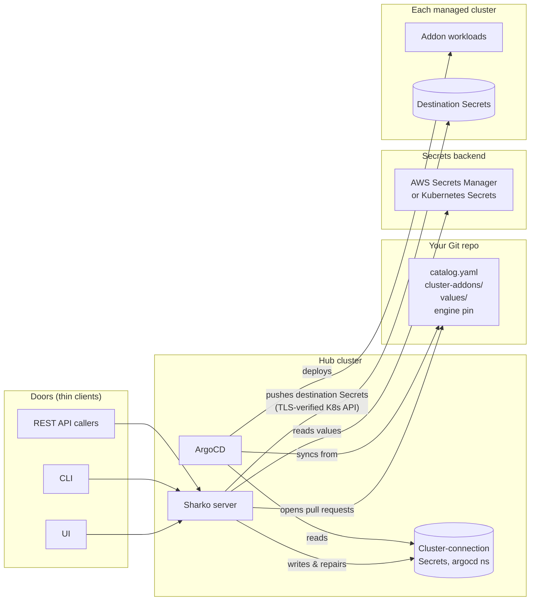
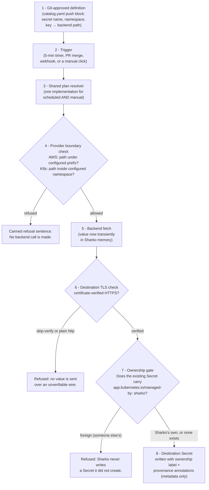

# The Engine and Secret Sync

This page explains, for platform and security engineers, exactly how Sharko turns Git files into running addons and how it delivers addon credentials to clusters — so you can assess the risk, grant least privilege, and know what keeps working when Sharko itself is stopped.

Three different things are easy to mix up, and this page keeps them apart throughout:

1. **The engine chart** — a versioned Helm chart ([`sharko-engine`](https://github.com/MoranWeissman/sharko/tree/main/charts/sharko-engine)) that converts the data files in your Git repo into ArgoCD ApplicationSets. It deploys addons. It never touches secret values.
2. **Cluster-connection credentials** — the Secrets in the ArgoCD namespace that tell ArgoCD how to reach each cluster. Sharko writes and repairs these on the hub.
3. **Addon Secret Sync** — the delivery engine that reads addon credentials from your configured secrets backend and pushes them into the clusters where an addon needs them. This is the only part of Sharko that moves secret *values*, and the rest of this page walks its path end to end.

## The pieces, and where each one runs

**On the hub cluster:** the Sharko server (UI, API, and the CLI's backend are all one process), ArgoCD, and the cluster-connection Secrets in the ArgoCD namespace. Every Sharko reconciler — the cluster-connection engine, the addon-values Secret Sync engine, the PR tracker — is a background loop inside that one server process.

**In your Git repo:** the addon catalog (`catalog.yaml` — which addons are approved, and for each addon-secret, *where its value lives in the backend*, never the value itself), the per-cluster assignments (`cluster-addons/<cluster>.yaml`), Helm values (`values/`), and the engine pin — the one line that says which version of the engine chart your fleet runs. When Sharko ships new deploy logic, you get a pin-bump pull request to review, not a live migration.

**On each managed cluster:** only the addon workloads ArgoCD deployed and the destination Secrets Sharko pushed. No Sharko agent, no controller, nothing of Sharko's runs remotely.

**The engine chart** (`charts/sharko-engine`) renders one ArgoCD ApplicationSet per approved addon, reading only your repo's data files. ArgoCD then generates one Application per cluster+addon pair and deploys it. The engine chart has no access to any secrets backend and renders no secret values — addon credentials are never part of a manifest.

## What keeps working when Sharko is stopped or removed

Sharko proposes; ArgoCD enforces. Because deployment is ArgoCD syncing from Git, stopping or removing Sharko does not stop your addons:

- **Keeps working:** every addon keeps running and syncing from Git; ArgoCD keeps using the cluster-connection Secrets already in place; every destination Secret Sharko pushed stays exactly where it is. Sharko's shutdown makes zero calls to any remote cluster — this is pinned by a test that seeds a Sharko-written Secret and asserts the shutdown performs no Kubernetes action at all (`internal/secrets/kill_sharko_test.go`).
- **Pauses:** rotation delivery (a value changed in the backend no longer reaches clusters), drift checks and repair, the UI/API/CLI, and audit recording. Nothing breaks; the fleet just stops getting updates until Sharko is back.

See [If You Remove Sharko](../operator/removing-sharko.md) for the full no-lock-in walk.

## Secret Sync: the data flow, boundary by boundary

This is the complete path a secret value takes. Every numbered arrow is a real check in code, and both the scheduled pass and every manual button go through the same ones.

Step by step, with where each lives in code:

1. **Git-approved definition.** What to deliver comes exclusively from the connected Git repo: the addon catalog's push definitions plus the managed-clusters list. A definition is metadata only — the destination Secret's name and namespace, and a map of data keys to *backend paths*. Raw values never belong in Git, and there is nowhere in the format to put one.
2. **Trigger.** A timer (default every 5 minutes, `SHARKO_SECRET_RECONCILE_INTERVAL`), a tracked pull request merging, a Git webhook, or a person: `POST /api/v1/secrets/reconcile` (everything), `POST /api/v1/clusters/{name}/secrets/refresh` (one cluster), or a row's own Sync button (one secret). All manual triggers need the operator role or higher.
3. **Shared plan resolver.** Scheduled and manual paths compute what to push with the *same single implementation* (`internal/secrets/reconciler.go` `planPushes`; the manual paths filter that one plan down — `sync_cluster.go` says this in its own header). There used to be an API path that delivered whatever an in-memory map said; it is gone, and its removal is the reason this page can promise one path. A cluster not in the Git list, or an addon Git defines no secret for, is refused with a fixed sentence.
4. **Provider boundary check.** Before any backend call, the provider itself checks the path (`internal/providers/boundary.go`): an AWS Secrets Manager connection only reads under its configured prefix — and an **empty prefix refuses every read** rather than meaning "the whole account"; a Kubernetes backend connection only reads inside its one configured namespace. The check lives in the provider, so every trigger inherits it — no caller can forget to ask.
5. **Backend fetch.** The value is fetched fresh on every pass and held only in memory, only for the duration of that one item's work. Sharko keeps **no second secret-value cache** — no disk, no database, no store of fetched values anywhere. The only thing remembered between passes is the delivery record: outcome, timestamp, and a canned error sentence when something failed.
6. **Destination TLS check.** Sharko refuses to send a value to a cluster whose connection skips certificate checks (`insecure-skip-tls-verify: true`, or ArgoCD's `insecure: true`) or uses plain `http://`. The hard stop lives in `remoteclient.EnsureSecret` — the one choke point every value-carrying write goes through — with an early check in the reconciler so the row records a plain refusal instead of a failed write. Reads and deletes still work on such a cluster; only value-carrying writes refuse.
7. **Ownership gate.** If a Secret with the target name already exists and does not carry `app.kubernetes.io/managed-by: sharko`, Sharko records it as **foreign** and never writes to it — not on the schedule, not on a Sync click, not even when the Secret appears in the race between Sharko's check and its own create (`internal/remoteclient/secrets.go`). Somebody else's Secret — a person's, External Secrets Operator's, a Helm chart's — stays somebody else's.
8. **Destination Secret.** A new Secret is labeled as Sharko's at birth and stamped with provenance annotations: which addon it belongs to, the backend's *name* (never a path, never a value), and when it was written. The annotations are built from a function that by construction can only take an addon name, a source label, and a timestamp.

### Where a raw value can and cannot appear

A raw secret value exists in exactly two places: inside your configured backend, and transiently in Sharko server memory between fetch and write. Everything else is delivery metadata. Specifically, raw values never appear in:

- **Git** — definitions are pointers (key → backend path), and previews redact values before rendering a diff.
- **API responses** — the live secret-view endpoints return data *key names* with every value blanked server-side; row errors are mapped to fixed canned sentences before they reach a browser, because a misbehaving backend SDK could in principle echo value fragments into its own error text (`internal/secrets/failure_sentence.go`, `internal/credsafe`).
- **Logs and events** — log lines carry cluster, addon, secret name, namespace; credentials-backend error text is replaced by one fixed sentence before logging.
- **Audit records** — entries carry actor, action, resource names, and counts, never content.
- **Metrics** — every label comes from a small fixed vocabulary (engine, state, a short reason code).
- **ArgoCD manifests and ArgoCD's Redis** — addon-secret values are pushed directly over the Kubernetes API, never rendered into any Application manifest, so they never enter ArgoCD's repo-server or its Redis manifest cache. Sharko itself runs no Redis. There is deliberately no ArgoCD Vault Plugin integration and no secret-injection bridge — that is a locked design constraint, not an omission.

The same rule holds for lengths and hashes: Sharko compares content by SHA-256 hash internally, but the hash is computed transiently and never stored, logged, or returned.

### Both triggers, one honesty

Worth stating once, explicitly, because it is the heart of the security model: **a scheduled pass and a manual click use the same Git-approved definitions, the same provider boundary checks, and the same ownership gate.** There is no privileged manual path, no request body that can name an arbitrary backend path or destination, and no way to use the API to fetch a value Sharko wouldn't have delivered on its own schedule.

## Cluster-connection credentials (the other Secrets)

For completeness — these are the Secrets on the *hub*, in the ArgoCD namespace, that ArgoCD uses to reach each cluster. Git is the source of truth for each connection definition; credential values are resolved from the referenced provider during reconciliation and are never stored in Git. Sharko owns and maintains the rendered ArgoCD cluster Secret — it creates a missing one and converges its addon labels on its own 30-second cadence, while a drifted connection detail is only ever applied through the explicit admin repair — and it only ever touches Secrets carrying its ownership label. They never leave the hub, and Secret Sync (this page's subject) is not involved in them. See [Drift Detection and Sync](../user-guide/drift-and-sync.md) and [Managing Cluster Connections Yourself](../operator/self-managed-connections.md).

## Where to go next

- [Permissions and Blast Radius](permissions-and-blast-radius.md) — exactly what Sharko's identities can reach, and how to cut them down.
- [Threat Model](threat-model.md) — what an attacker gets at each foothold, stated plainly.
- [Secret Sync Debugging](../operator/secret-sync-debugging.md) — diagnosing every failure path without ever printing a value.
- [Secrets (user guide)](../user-guide/secret-sync.md) — the same engine as its pages appear in the UI.
