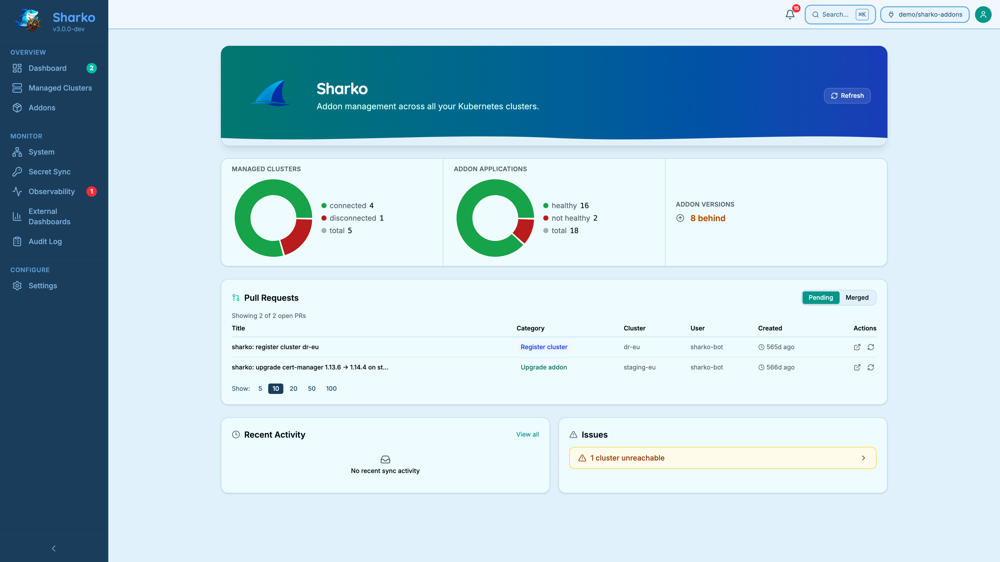

# Sharko

<p align="center">
  
</p>

<p align="center"><em>Declarative addon management for Kubernetes clusters, built on ArgoCD.</em></p>

!!! info "Sharko v4 is currently intended for evaluation and staging environments"
    Start with the
    [latest published v4 release](https://github.com/MoranWeissman/sharko/releases/latest)
    and read the [current limitations](technical-preview.md) before wider
    deployment.

Sharko manages the addons on your Kubernetes fleet — cert-manager, monitoring, logging, and anything else you run everywhere — from a single dashboard, CLI, or REST API. It rests on two simple ideas.

**The engine is Sharko's. The repo is yours.** All the logic that turns "which addons go where" into real ArgoCD Applications lives in one place: [`sharko-engine`](https://github.com/MoranWeissman/sharko/tree/main/charts/sharko-engine), a versioned, signed Helm chart published right next to the Sharko server image. Your repo pins one version of that chart. When Sharko ships new deploy logic, you get a small pin-bump pull request to review and merge — never a live migration you have to plan around.

**Your repo holds data, not templates.** Open it and you'll find small, readable files: `catalog.yaml` (which addons are approved), `cluster-addons/<cluster-name>.yaml` (which addons run where), and a `values/` folder for Helm values. No template logic to write or maintain. Your repo, Sharko's format — read it any time, write through Sharko.

Three doors lead to the same pipeline: the UI, for a person clicking through a change; the REST API, for a portal or a pipeline acting on someone's behalf; and the CLI, which wraps that same API. Every write does the same three things — validate, preview, then open a Git pull request. **Sharko proposes, ArgoCD enforces:** Sharko doesn't deploy workloads — ArgoCD does that, by syncing from Git. Sharko does manage the ArgoCD connection Secret and addon secrets on the cluster directly; everything else goes to Git first.

And if you ever want to stop using Sharko, you can. Remove it and every addon keeps running and syncing, because ArgoCD was always the one deploying them from Git — not Sharko. See [If You Remove Sharko](operator/removing-sharko.md) for exactly what stops and what doesn't.


**See Sharko in action:**

{ loading=lazy }

<div class="grid cards" markdown>

-   :material-rocket-launch:{ .lg .middle } **Getting Started**

    ---

    Install Sharko and register your first cluster.

    [:octicons-arrow-right-24: Quickstart](getting-started/quickstart.md)

-   :material-book-open:{ .lg .middle } **User Guide**

    ---

    Day-to-day operations: clusters, addons, values, upgrades.

    [:octicons-arrow-right-24: Read the guide](user-guide/connections.md)

-   :material-tools:{ .lg .middle } **Operator Manual**

    ---

    Install, configure, secure, and troubleshoot a Sharko deployment.

    [:octicons-arrow-right-24: Operator docs](operator/installation.md)

-   :material-console:{ .lg .middle } **API Reference**

    ---

    Swagger-generated endpoint docs for every tier.

    [:octicons-arrow-right-24: API docs](api/overview.md)

</div>

## Key Features

- **Versioned engine, data-only repo** — the deploy logic ships as a signed Helm chart your repo pins; your repo itself holds only small YAML files, never template logic
- **Wizard-based setup** — guided first-run configures Git, ArgoCD, secrets provider, and initializes your repo
- **Fleet dashboard** — cluster health cards, addon version matrix, drift detection
- **Managed vs discovered clusters** — adopt existing ArgoCD clusters into Sharko management in one click
- **GitOps-native** — all write operations create PRs; auto-merge optional. Preview the actual file changes (line-by-line diff, secrets redacted) before the PR opens.
- **Unified API** — CLI, UI, Backstage, Terraform, and CI/CD all use the same REST API
- **Secrets management** — deliver credentials to remote clusters (AWS SM or Kubernetes Secrets, no ESO)
- **AI assistant** — context-aware troubleshooting with OpenAI, Claude, Gemini, or Ollama
- **API keys** — long-lived tokens for non-interactive consumers
- **No lock-in** — remove Sharko and every addon keeps running and syncing from Git

## Try the Demo

No cluster required — mock backends simulate ArgoCD, Git, and secrets providers:

```bash
git clone https://github.com/MoranWeissman/sharko.git
cd sharko
make demo
```

Open [http://localhost:8080](http://localhost:8080) and log in with `admin` / `admin`.
