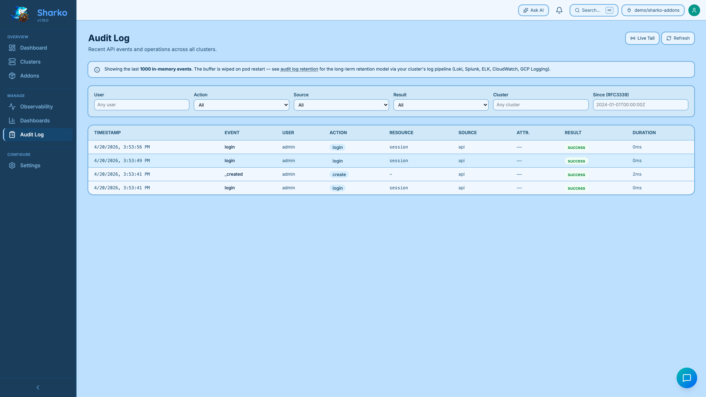

# Audit log — retention model

Sharko emits an audit record for every mutating API call (cluster registration, addon add/remove/upgrade, secret reconciliation, init runs, webhook events). The same record is delivered to **two streams** with very different lifetimes — operators need to understand both.

## Two streams, one record

| Stream | Where | Lifetime | Use it for |
|--------|-------|----------|------------|
| In-memory ring buffer | UI, `GET /api/v1/audit`, SSE `/api/v1/audit/stream` | Last **1000 entries**, wiped on pod restart | Live debugging, "what just happened?" |
| Structured stdout | Pod logs (`kubectl logs deployment/sharko`) | Whatever your cluster log pipeline retains (days to years) | Forensics, compliance, long-term reporting |

Both streams emit **the same fields** — `id`, `timestamp`, `event`, `user`, `action`, `resource`, `source`, `result`, `duration_ms`, `attribution_mode`, `tier`. The stdout records are JSON, one event per line, suitable for ingestion by any standard log shipper.

{ loading=lazy }
<figcaption>Audit Log tab showing the in-memory ring buffer with filter controls.</figcaption>

## Why this design

Sharko is **stateless**. Persistent audit storage would mean either bolting on a database (ops burden, schema migrations, backup story) or writing files to a PVC (single-pod limit, lost on PVC reclaim). Neither fits a Kubernetes-native control plane that operators expect to scale, restart, and roll forward without ceremony.

Cluster log aggregation already exists in essentially every production environment — that's where audit records belong. Sharko's responsibility is to emit the data in a structured, machine-readable shape; long-term retention is the cluster operator's job.

This is captured in the [V2 PRD](https://sharko.readthedocs.io/en/latest/architecture/overview/) as functional requirement FR-7.3.

## Setting up long-term retention

Pick whichever of these matches your environment. All you need is to ship `kubectl logs deployment/sharko -n sharko` to a queryable backend — Sharko does not care which one.

### Loki (Grafana stack)

Promtail or the Loki agent already running in your cluster picks up the pod's stdout automatically. Query in Grafana with:

```logql
{namespace="sharko", pod=~"sharko-.*"} | json | event != ""
```

### Splunk

Splunk's `splunk-otel-collector` (or the legacy `splunk-connect-for-kubernetes`) picks up pod logs. Filter by the `kubernetes.namespace_name` field and parse the JSON event in your search.

### ELK / Elastic

Filebeat with the standard Kubernetes autodiscovery configuration captures the records. Use `kubernetes.namespace = "sharko"` and a JSON parsing processor.

### AWS CloudWatch Logs

Either the CloudWatch agent on EKS nodes or the `aws-for-fluent-bit` add-on ships pod logs to a log group named after the cluster. Use a metric filter or CloudWatch Logs Insights to query.

### Google Cloud Logging

GKE ships pod logs automatically. Filter with:

```
resource.type="k8s_container"
resource.labels.namespace_name="sharko"
jsonPayload.event != ""
```

## What "wiped on pod restart" actually means

The ring buffer lives in the Sharko process memory. Anything that restarts the pod — new image roll-out, a node drain, an OOM kill, `kubectl rollout restart` — empties the buffer. The records that were in the buffer at that moment are still in the **stdout stream**, so they are still in your log pipeline; they just disappear from the UI.

The UI banner at the top of the Audit Log page reminds operators of this so they don't conclude that events were lost.

## Reading the structured stdout records

Each record is a single JSON line. The minimum useful query is "everything that mutated state in the last hour":

```bash
kubectl logs deployment/sharko -n sharko --since=1h \
  | grep '"audit":' \
  | jq 'select(.action != "" and .result != "")'
```

For deeper investigation pipe through `jq` to filter by `user`, `cluster`, `action`, etc. — the same fields you can filter on in the UI.

## Related

- [Troubleshooting](troubleshooting.md) — broader log-and-debug guidance
- [Security](security.md) — audit fields used for compliance
- [Configuration](configuration.md) — `SHARKO_AUDIT_BUFFER_SIZE` env var to change the in-memory ring buffer cap
