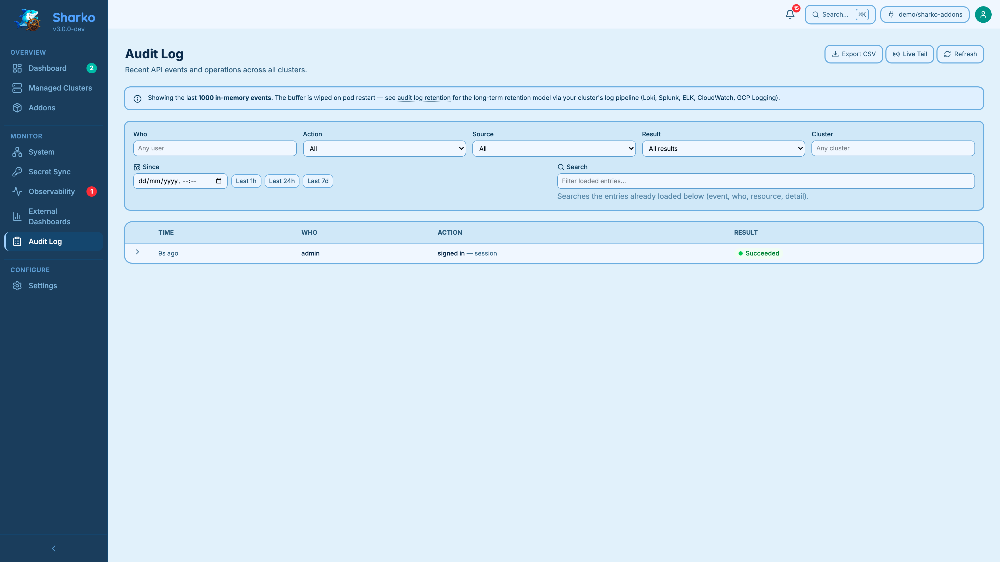

# Activity history — what Sharko keeps and for how long

> **Reference page, not a runbook.** This page says where Sharko's
> activity history lives, how long it lasts, and what you can and
> cannot do about that. If you are looking for a specific failure to
> diagnose, search
> [`failure-mode-index.md`](failure-mode-index.md) by your error message
> instead.

Sharko records an entry for every request that changes something —
registering a cluster, adding, removing or upgrading an addon, delivering
secrets, first-run setup, incoming webhooks.

!!! danger "This history is held in memory only. A restart loses all of it."
    Sharko keeps the **last 1000 entries** in memory and writes them
    nowhere else — no disk, no database, no volume, no log stream. Any
    restart empties it completely. **Do not rely on this as your record of
    what happened.** See
    [Technical preview](../technical-preview.md#4-the-activity-history-lives-in-memory-and-is-gone-when-sharko-restarts).

## Where the entries go

| Where | Lifetime |
|-------|----------|
| The Activity page in the UI | The last 1000 entries, since this pod started |
| `GET /api/v1/audit` | The same list |
| `GET /api/v1/audit/stream` | A live feed of new entries, while you stay connected |

All three read the same in-memory list. There is no fourth place.

Each entry carries `id`, `timestamp`, `event`, `user`, `action`,
`resource`, `source`, `result`, `duration_ms`, `changes`,
`attribution_mode` and `tier`.

### The `changes` field

`changes` says whether the operation behind the entry really changed
anything. It is separate from `result`, which says whether the operation
finished:

| `changes` | Meaning |
|-----------|---------|
| `not_applicable` | A read-only check. Nothing was ever going to change. |
| `none` | An action ran and deliberately wrote nothing. |
| `applied` | Something really changed. |
| absent | The writer did not say. Readers render nothing — never "no changes made". |

`GET /api/v1/audit` has no typed response schema in the OpenAPI document
(the endpoint is declared as a free-form object), so `changes` does not
appear there. It is present on every entry the API returns.

{ loading=lazy }
<figcaption>Audit Log tab showing the in-memory history with filter controls.</figcaption>

## What "lost on restart" means in practice

The list lives inside the Sharko process. Anything that restarts the pod —
a new image, a node drain, an out-of-memory kill, `kubectl rollout
restart` — empties it. Those entries are gone. They are not recoverable
from anywhere.

The Activity page says so at the top, so nobody reads an empty page as
"nothing has happened".

The 1000-entry cap is fixed in the code. Sharko reads no environment
variable and has no setting for it, so nothing you put in `extraEnv` will
change it. A busy Sharko drops its oldest entries once it passes 1000,
restart or no restart.

## If you need a record that survives

**Sharko cannot give you one today, and no setting changes that.** Making
this history durable is real, open work. It belongs with a wider question
about what else Sharko should remember across restarts, so it is not a
small change.

What you have outside Sharko, and what each one actually covers:

- **Your Git repository.** Every change Sharko makes to what runs on your
  clusters goes through a commit and a pull request, and your Git host
  keeps those for as long as you keep the repository. This is the most
  complete record available today of *what changed*, and it carries who
  asked for it — see [Git attribution](../user-guide/attribution.md).
  It does **not** cover reads, failed attempts, sign-ins, or anything
  Sharko does that is not a repository change.
- **Kubernetes Events.** Sharko writes Events for operational successes
  and failures — see [Sharko Events](sharko-events.md). Your cluster
  keeps Events for a limited window (an hour by default on many clusters)
  unless you ship them somewhere. They cover a different set of things
  from the activity history, not the same set.
- **Sharko's own pod log.** Sharko logs plenty as it works, and your log
  pipeline will keep that. **These are ordinary log lines, not activity
  entries** — they do not carry the fields above and there is no query
  that turns them into the same list. Treat them as background for an
  investigation, not as a record.

None of these three is a substitute for the activity history. If you have
to be able to answer "who changed this, and when" weeks later, Sharko
cannot answer it today.

## Related

- [Technical preview](../technical-preview.md) — this limit alongside the
  other things you should know before trusting Sharko
- [Troubleshooting](troubleshooting.md) — broader log-and-debug guidance
- [Security](security.md) — the wider security posture
- [Configuration](configuration.md) — the settings Sharko really reads
