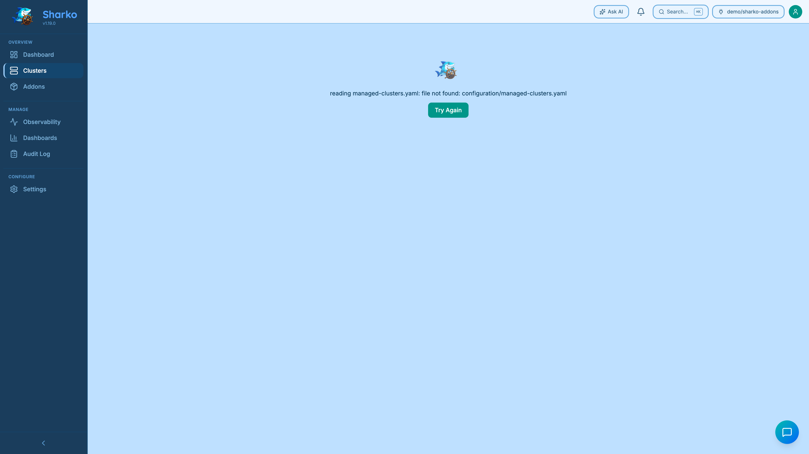

# Managing Clusters

Clusters are the units of deployment in Sharko. Each registered cluster gets its own values directory in the addons repo, and ArgoCD manages addon deployments for it via the ApplicationSet.

{ loading=lazy }
<figcaption>Cluster detail — deployed addons, per-cluster values overrides, and pending PRs.</figcaption>

## Managed vs Discovered Clusters

Sharko distinguishes between two types of clusters:

| Type | Description |
|------|-------------|
| **Managed** | Registered via Sharko — has a values file in Git. Full lifecycle management: addons, upgrades, secrets reconciliation. |
| **Discovered** | Found in ArgoCD but not registered via Sharko — no values file in Git. Sharko surfaces these as read-only and offers an **Adopt** path. |

In the API, every cluster entry includes a `"managed": true/false` field. In the UI, the Clusters page shows managed clusters as the main list; Discovered clusters are collapsed into a single hint line with a count (e.g. "3 clusters found in ArgoCD that Sharko doesn't manage yet") — click it to open **Register New Cluster** pre-set to the "I do" connection-ownership choice, described below.

## Preview Changes Before a PR Opens

Sharko is a GitOps agent: every change it makes to your GitOps repository goes through a pull request — it never mutates live state. Before opening that PR, the UI offers a **"Preview changes"** button on every PR-opening operation.

Clicking **Preview changes** runs a server-side dry-run (no branch, no commit, no PR) and shows exactly what the PR would contain:

- The files it would write (create or update)
- For destructive operations (removing a cluster, un-adopting, removing an addon), the files or entries it would **delete** (shown distinctly)
- The PR title
- The names of any secrets it would create (names only — never secret values)

You then confirm to actually open the PR, or cancel and adjust your input.

This transparency feature is available on all PR-opening operations: register cluster, adopt cluster, remove cluster, un-adopt cluster, add addon, remove addon, configure addon, enable/disable addons on a cluster (Apply Changes), update cluster settings (secret path), save default addons, and save/refresh addon values (global + per-cluster).

Under the hood, this uses the API's `dry_run: true` request option, which returns a `DryRunResult` instead of opening a PR. See [API Walkthrough](../api/api-walkthrough.md) for examples of using `dry_run` from the command line.

## Discovering Available Clusters

Before registering, you can see which clusters are available from your secrets provider:

```bash
sharko list-clusters --available
```

Or in the UI: **Clusters → Register Cluster → Browse Available**.

## Adding a Cluster

When you register a cluster, one of the things to settle is **how should Sharko get this cluster's credentials?** There are three answers, and you pick one — or none at all:

| Credentials source | What it means | You supply |
|--------------------|---------------|------------|
| **Paste a kubeconfig** | You hand Sharko the kubeconfig directly. Bearer-token auth only. | The kubeconfig YAML |
| **Point at a stored kubeconfig** | The kubeconfig already lives in your secret backend (AWS Secrets Manager, GCP Secret Manager, Azure Key Vault, or a Kubernetes Secret). Works for **any** cluster, including local / on-prem. | The secret path/name |
| **Amazon EKS token** | Sharko mints a short-lived token from your EKS cloud identity, so nothing long-lived is stored or pasted. EKS only. | The AWS region |

The credentials source is the *only* thing that changes between these three. Everything else — which addons to enable, the environment label, the cluster name — works the same way no matter how Sharko reaches the cluster.

!!! tip "Credentials are entirely optional at registration"
    Since V2-cleanup-88.3, you can skip the credentials source altogether and register with none of the three. Registration always succeeds — addons deploy through the normal Git → ArgoCD path, which never needs Sharko's own cluster access. The only place credentials become required is enabling an addon that pushes its own secrets to the cluster (a `secrets:` block in its catalog entry, e.g. Datadog API keys): that specific action is rejected with a `422` naming exactly what's missing, until you add credentials. A secret-less addon enables with zero friction either way. See [Cluster Connectivity Model](../operator/cluster-connectivity-model.md#registration-works-with-zero-credentials-lazy-credentials) for the full model. In the UI, a cluster missing credentials shows a pre-warning on the Apply button for a secret-bearing addon, before you hit the same 422 the API would return.

In the register dialog, a one-line strip above the credentials fields ("Layer 1 — Identity") tells you whether Sharko already has its own AWS identity — useful for the EKS token source. The full identity detail (ARN, detection method, how it works) used to live in the dialog itself; it now lives on the **System** page (left navigation), which also shows the whole Sharko → ArgoCD → Git → clusters chain in one read-only screen.


### Via CLI

```bash
sharko add-cluster my-cluster \
  --addons cert-manager,metrics-server,monitoring \
  --region us-east-1
```

Flags:

| Flag | Description |
|------|-------------|
| `--addons` | Comma-separated list of addons to enable on this cluster. If omitted, Sharko applies the default addons from `configuration/default-addons.yaml` (see [Default Addons](addons.md#default-addons)) |
| `--region` | AWS region — use this for the **Amazon EKS token** source |
| `--env` | Environment label (e.g., `prod`, `staging`) — auto-detected from name if `config.environments` is set |
| `--secret-path` | The path/name of a stored kubeconfig — use this for the **stored kubeconfig** source (see [Secret Path](#secret-path)) |

### Via UI

1. Navigate to **Clusters → Register Cluster**
2. Choose **how Sharko should get the credentials** — paste a kubeconfig, point at a stored kubeconfig, or mint an Amazon EKS token
3. Fill in what that source needs (the kubeconfig YAML, the secret path, or the AWS region)
4. Choose which addons to enable (or leave empty to use the [default addons](addons.md#default-addons))
5. Click **Register** — Sharko creates a PR in your Git repo

!!! note "Old registrations still work the same"
    The credentials source is optional behind the scenes. A registration that doesn't name one keeps behaving exactly as it did before — Sharko figures out the source from the fields you provide. Nothing you set up earlier changes.

!!! info "Planned — finer-grained credentials"
    Today the stored-kubeconfig source points at a *whole* kubeconfig. A future release plans to let you point at individual pieces (server URL, CA data, token) separately. This is **not available yet**.

### Batch Registration

Register multiple clusters at once:

```bash
sharko add-clusters cluster-a,cluster-b,cluster-c \
  --addons cert-manager,metrics-server
```

Or via API:

```bash
curl -X POST https://sharko.your-domain.com/api/v1/clusters/batch \
  -H "Authorization: Bearer <token>" \
  -H "Content-Type: application/json" \
  -d '{
    "clusters": [
      {"name": "cluster-a", "addons": ["cert-manager"]},
      {"name": "cluster-b", "addons": ["cert-manager", "monitoring"]}
    ]
  }'
```

## Viewing Cluster Status

```bash
sharko status
```

Output shows all registered clusters with sync status, addon counts, and health indicators.

In the UI, the **Fleet** page shows health cards for every cluster. Click a cluster to see its detail page with:

- Addon list with per-addon health and version
- Drift detection (addons running a different version than the catalog target)
- ArgoCD sync status
- Connected/disconnected indicator

## Updating a Cluster

Update which addons are enabled on a cluster:

```bash
sharko update-cluster my-cluster \
  --addons cert-manager,metrics-server,logging
```

This creates a PR that adds or removes addon entries from the cluster's values file.

Via UI: on the cluster detail page, click **Edit Addons**.

!!! note "Enabling a secret-bearing addon on a credential-less cluster"
    If the addon you're enabling declares its own secrets (see [Addon Secrets](addons.md#addon-secrets)) and this cluster has no resolvable connection credentials, the request is rejected with a `422` naming what's missing — see [Adding a Cluster](#adding-a-cluster) above. Addons with no secrets enable regardless.

## Removing a Cluster

```bash
sharko remove-cluster my-cluster
```

This creates a PR that removes the cluster's directory from the addons repo. After the PR is merged and ArgoCD syncs, the cluster's ApplicationSet entries are removed.

!!! warning
    Removing a cluster from Sharko does not uninstall addons from that cluster. ArgoCD will stop managing them, but the Helm releases remain in place. Uninstall addons manually if needed.

## What Shows in a Cluster's Addon List

When viewing a cluster's detail page, the Addons list shows only the addons **Sharko manages** for that cluster — the ones enabled for it in your GitOps configuration — plus Sharko's own connectivity-check Application.

If you adopt a cluster that already runs ArgoCD Applications the user deployed themselves (e.g., a guestbook app, a hello-world, any workload unrelated to Sharko), those foreign Applications are **not** listed as addons. An addon is something Sharko manages via your catalog and GitOps config; a random Application running on the cluster is not an addon, and on a busy adopted cluster listing them all would be noise.

## Adopting an Existing ArgoCD Cluster

If a cluster is already registered in ArgoCD but was not registered through Sharko (e.g., it was added manually or by another tool), you can adopt it:

```bash
sharko adopt-cluster my-cluster --addons cert-manager,metrics-server
```

Or via API:

```bash
curl -X POST https://sharko.your-domain.com/api/v1/clusters/my-cluster/adopt \
  -H "Authorization: Bearer <token>" \
  -H "Content-Type: application/json" \
  -d '{"addons": ["cert-manager", "metrics-server"]}'
```

If you omit the `--addons` flag (CLI) or `addons` field (API), Sharko applies the [default addons](addons.md#default-addons) from `configuration/default-addons.yaml`, just like when registering a new cluster.

What the adopt operation does:

1. Verifies the cluster exists in ArgoCD
2. Verifies there is no existing values file in Git (returns 409 if already managed)
3. Generates a values file from the current ArgoCD cluster labels
4. Creates a PR to add the values file to the Git repo
5. Marks the cluster as managed in ArgoCD labels

The cluster does **not** need to be in your secrets provider — it is already in ArgoCD, so no kubeconfig fetch is required for the adoption step.

!!! tip "Adopting from the register dialog"
    Since V2-cleanup-89.3, you don't have to go find `adopt-cluster` separately. In **Register New Cluster**, pick **"I do — Sharko only manages addon labels"** for connection ownership, and if ArgoCD already knows about clusters Sharko doesn't manage yet, a **"Pick from what ArgoCD already has"** list appears — showing each one by name and server URL. Pick one and confirm; it runs the exact same adopt flow as `adopt-cluster` (same verify-then-confirm dialog, same Git-PR result). This block is hidden entirely when there's nothing to pick from. Typing in coordinates by hand is still available below it, for a cluster ArgoCD doesn't know about yet.

## Testing Cluster Connectivity

Verify that Sharko can reach a cluster's Kubernetes API:

```bash
sharko test-cluster my-cluster
```

Or via API:

```bash
curl -X POST https://sharko.your-domain.com/api/v1/clusters/my-cluster/test \
  -H "Authorization: Bearer <token>"
```

Response:

```json
{"reachable": true, "version": "v1.29.3"}
```

Or if unreachable:

```json
{"reachable": false, "error": "connection refused"}
```

In the UI, a **Test connection** button on the cluster detail page shows the result as an inline badge.

!!! tip
    Use connectivity tests after rotating cluster credentials or after ArgoCD reports a cluster as `Unknown`. It is a lightweight check (calls `ServerVersion()` only — no cluster-wide list operations).

When Test connection fails and you need to know *which* link broke — credentials, addon-secret paths, an IAM role, the cluster's own trust, or (for a self-managed connection) another ArgoCD Application fighting Sharko over the connection secret — click **Run connection doctor** on the same page, or `POST /api/v1/clusters/{name}/doctor`. It runs five real-attempt checks in one call and returns a plain-English fix per failure. See [Connection Doctor](../operator/connection-doctor.md) for what each check means.

## Checking the Last Reconcile / Manual Sync

Sharko's cluster-secret reconciler runs every 30 seconds in the background, converging the ArgoCD cluster Secret's addon labels (and, for Sharko-managed connections, the credentials themselves) to match what's declared in Git. `GET /api/v1/clusters/{name}` includes a `last_reconcile` field showing the most recent outcome (`succeeded`, `failed`, or `skipped`) with a plain-English message on failure — this used to be visible only in the server log. In the UI, it's the **"Last sync"** line on the cluster detail page.

To nudge a reconcile immediately instead of waiting for the next tick, click **Sync now** on the cluster detail page, or:

```bash
curl -X POST https://sharko.your-domain.com/api/v1/clusters/my-cluster/reconcile \
  -H "Authorization: Bearer <token>"
```

This returns `202` right away — the reconcile itself runs in the background. Poll `GET /clusters/{name}` afterward and read the updated `last_reconcile` field.

!!! note "Self-managed connections: a 'succeeded' sync with a warning"
    On a self-managed connection, if another ArgoCD Application is also rendering the same connection secret from Git, the reconciler can end up in a tug-of-war over the addon-label values. `last_reconcile.outcome` stays `succeeded` in that case — Sharko is still successfully re-applying its labels every tick — but the message names the pattern after two reverts in a row. See [Managing Cluster Connections Yourself](../operator/self-managed-connections.md#when-another-argocd-application-also-renders-this-secret).

## Refreshing Cluster Credentials

If a cluster's kubeconfig or credentials have changed in the secrets provider:

```bash
# Via CLI
curl -X POST https://sharko.your-domain.com/api/v1/clusters/my-cluster/refresh \
  -H "Authorization: Bearer <token>"
```

Or in the UI: cluster detail page → **Refresh Credentials**.

## Secret Path

By default, Sharko looks up credentials in the secrets provider using the cluster name as the path. If your secrets follow a different naming convention (e.g., `clusters/prod/my-cluster` instead of `my-cluster`), you can override this with `--secret-path`:

```bash
sharko add-cluster my-cluster \
  --secret-path clusters/prod/my-cluster \
  --addons cert-manager
```

The `secret_path` is stored on the cluster record and used for all future credential fetches (refresh, connectivity test, secrets reconcile). You can also set it via the API:

```bash
curl -X POST https://sharko.your-domain.com/api/v1/clusters \
  -H "Authorization: Bearer <token>" \
  -H "Content-Type: application/json" \
  -d '{
    "name": "my-cluster",
    "secret_path": "clusters/prod/my-cluster",
    "addons": ["cert-manager"],
    "region": "eu-west-1"
  }'
```

### Smart Search with Suggestions

If no exact match is found at the expected path, Sharko automatically searches the entire secrets prefix for a close match (suffix / substring on the final path segment) and returns suggestions alongside the error:

```json
{
  "error": "cluster not found",
  "suggestions": [
    "clusters/prod/my-cluster",
    "clusters/staging/my-cluster"
  ]
}
```

Use `--secret-path` with the suggested path to register with the correct secret. In the UI, suggestions are shown as clickable chips below the cluster name input when an exact match fails.

## Cluster Environments

If `config.environments` is set (e.g., `"dev,qa,staging,prod"`), Sharko extracts the environment label from the cluster name automatically:

- `nms-core-dev-eks` → env `dev`
- `app-prod-eu-west` → env `prod`

This label is displayed in the UI and can be used for filtering. Set it manually with `--env` if auto-detection doesn't work for your naming convention.

## Initialization Progress in Settings

When initializing the addons repository from the **Settings** page (rather than the first-run wizard), the UI now displays a live progress log showing each step as it completes — the same streaming view shown in the wizard.

The progress panel appears inline in the Connections section when you click **Initialize**. It shows:

- Branch creation and file commit progress
- PR creation and auto-merge status (if enabled)
- ArgoCD bootstrap sync polling — individual step status (`Pending`, `Syncing`, `Healthy`)

Once the init operation succeeds, the progress panel is replaced with a success state and a link to the ArgoCD root application. If the operation fails, the last log line is highlighted in red with the error message.

!!! tip
    If you navigate away from Settings during initialization, the operation continues in the background. Return to Settings to see the final result — the operation ID is persisted in the browser session.

## Filtering and Sorting Clusters

The `GET /api/v1/clusters` endpoint and the Clusters UI both support filtering and sorting:

### Sorting

```bash
# Sort by name (default)
curl .../api/v1/clusters?sort=name

# Sort by health, descending
curl .../api/v1/clusters?sort=-health
```

Supported sort fields: `name`, `env`, `health`, `addon_count`.

### Filtering

```bash
# Only production clusters
curl .../api/v1/clusters?filter=env:prod

# Only clusters with a specific addon enabled
curl .../api/v1/clusters?filter=addon:cert-manager

# Combined (AND logic)
curl .../api/v1/clusters?filter=env:prod&filter=health:healthy
```

In the UI, the sort dropdown and filter input are rendered above the clusters list.
