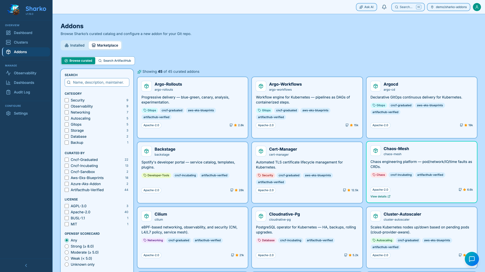
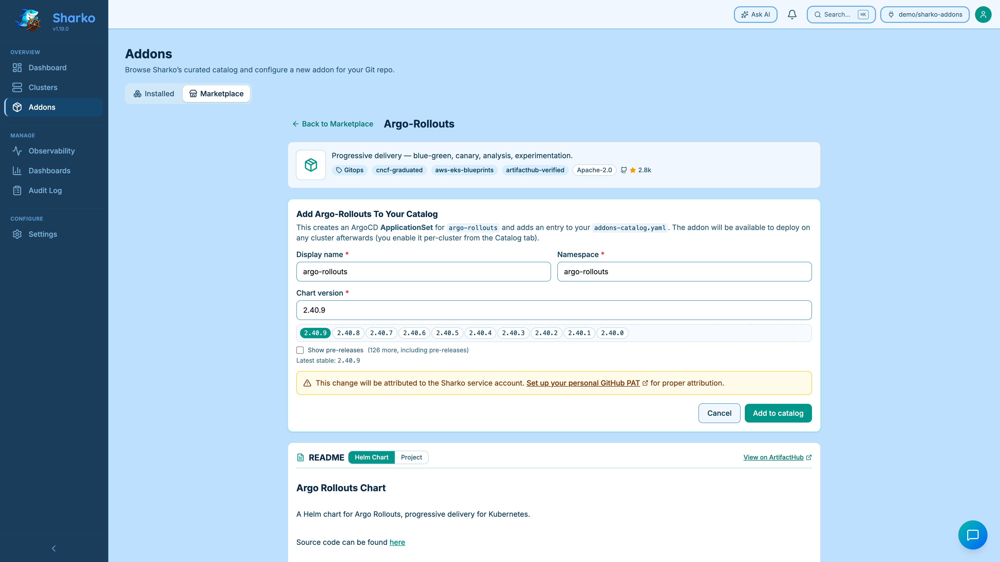

# Marketplace

The **Marketplace** is Sharko's curated catalog of community Helm charts that you can add to your cluster fleet without leaving the UI. It surfaces the projects we've vetted (CNCF graduates, AWS EKS Blueprints, Bitnami baseline picks, and a small set of vendor-curated charts) along with an OpenSSF Scorecard signal so you can pick safer-by-default options first.

The Marketplace is a **read-only browse experience**. Submitting an addon goes through the same v1.20 GitOps PR flow as every other Sharko mutation — nothing lands in your `addons-catalog.yaml` until a pull request opens (and, if your active connection has `pr_auto_merge` enabled, merges automatically).

## Overview — three ways to add an addon

Sharko gives you three discovery paths. Pick the one that matches what you already know about the chart.

| Path | When to use it | Where it lives |
|------|----------------|----------------|
| **Browse curated** | You want a recommended addon for a category (security, monitoring, ingress…) and care about a sane default + Scorecard signal. | Marketplace tab → Browse subtab |
| **Search ArtifactHub** | You know the chart name (e.g. `loki`, `vault`) and want to discover it across both our curated catalog and the wider ArtifactHub corpus. | Marketplace tab → Search subtab |
| **Manual Add Addon** | You're installing a chart that isn't in our catalog and isn't on ArtifactHub — internal repos, vendor charts hosted on a homepage CDN, custom forks. | Catalog tab → **Add Addon** button — see [Managing Addons](addons.md#adding-an-addon-to-the-catalog) |

All three paths land in the same place: a PR against your `addons-catalog.yaml`, a generated `addons-global-values/<addon>.yaml`, and an audited `addon_added` event with a `source` detail field that records which path you used.

> The Paste-Helm-URL tab that early v1.21 builds shipped was retired in QA so the Marketplace stays focused on discovery — manual Add Addon now auto-validates the repo URL and lists the available chart names, replacing what Paste URL did.

## Browsing the catalog

{ loading=lazy }
<figcaption>Marketplace Browse tab with OpenSSF tier, curator, and license filters.</figcaption>

1. Open **Addons** in the left rail.
2. Switch to the **Marketplace** tab at the top of the page.
3. The Marketplace has two subtabs: **Browse curated** (default) and **Search ArtifactHub**.

### Browse curated

Use the sidebar to filter by **Category**, **Curated by** (e.g. `cncf-graduated`, `aws-eks-blueprints`), **License**, or **OpenSSF tier** (Strong / Moderate / Weak / Unknown). Categories OR within the axis; curators AND.

Filters are persisted in the URL, so `?mp_cat=security&mp_tier=strong` deep-links you to a specific slice.

Each card shows the chart name, a one-line description, the OpenSSF score badge, the license, the maintainers, and a docs link when one's published. If a card's chart is **already in your catalog**, an **In catalog** badge appears in the corner with a quick link to `/addons/<name>` so you don't accidentally open a no-op PR.

OpenSSF scores refresh once a day at 04:00 UTC against the public [Scorecard API](https://api.scorecard.dev). Scores are cached in-memory; on a fresh pod restart the catalog falls back to the bundled baseline scores until the next 04:00 UTC tick. If the Scorecard API is unreachable, the previous score sticks (no zeroing) and a warning is logged. The current refresh status is exposed via the Prometheus metrics `sharko_scorecard_refresh_total{status}` and `sharko_scorecard_last_refresh_timestamp`.

### Search ArtifactHub

Click **Search ArtifactHub** when you want a chart that isn't in our curated catalog. Type any name; results appear in two stacked sections:

- **Curated by Sharko** (top) — full catalog cards with the same in-page detail flow as Browse.
- **From ArtifactHub** (bottom) — slim cards tagged "ArtifactHub" with verified-publisher badge and star count when applicable.

Sharko proxies ArtifactHub server-side — your browser never calls them directly — so search results are cached for 10 minutes per query. If ArtifactHub is unreachable (network blocked, rate-limited, or down), the curated section still works and you'll see an amber banner: *"ArtifactHub unreachable — showing curated only."* with a **Retry connectivity** button that re-probes immediately. This is the air-gap fallback path: an air-gapped operator who pre-pulls the curated catalog continues to function with Browse + curated-section Search even with no outbound internet.

When you click an ArtifactHub result, the same in-page detail view opens (just like a curated card) — pre-filled with the chart name, repo URL, license, maintainers, and the upstream README — all fetched from ArtifactHub's package detail. The Submit & PR flow is identical to a curated entry.

## Adding an addon

{ loading=lazy }
<figcaption>Marketplace addon detail — README, version picker, and Add-to-catalog panel.</figcaption>

Clicking a Marketplace card swaps the Marketplace grid for an **in-page addon detail view**. The detail view has four sections, top to bottom:

1. **Hero** — addon icon, name, one-line description, category and curator chips, license, OpenSSF Scorecard tier, GitHub stars.
2. **Add to your catalog** — an embedded form (NOT a popup) with an explainer:
   > This creates an ArgoCD ApplicationSet for `<addon>` and adds an entry to your `addons-catalog.yaml`. The addon will be available to deploy on any cluster afterwards.
   Fields are **Display name** (defaults to the chart name), **Namespace** (defaults to the chart's recommended namespace), and **Chart version** (top-10 stable picker; tick **Show pre-releases** to expand). The submit button is labelled **Add to catalog**. There is no sync-wave field — you set sync wave on the addon page after the PR merges (see [Editing ArgoCD App Options](argocd-app-options.md)).
3. **README** — two tabs, **Helm Chart** (default) and **Project**. The Helm Chart tab renders the upstream chart README fetched from ArtifactHub. The Project tab (added in v1.21 QA Bundle 4) fetches the upstream project's README from GitHub (resolved server-side via the chart's `source_url` or `homepage`) — use this when the chart README is a thin install blurb and you want the tool's own docs. The Project tab lazy-loads on click so we don't pay GitHub API round-trips for users who never open it. When `source_url` isn't a GitHub URL or the repo has no `README.md`, the Project tab shows a "Project README not available" empty state. A **View on ArtifactHub** / **View on GitHub** link sits in the section header depending on which tab is active. The README panel reserves a stable scrollbar gutter so the scroll track stays visible on long READMEs (argo-cd is a good test subject). The detail view is constrained to `max-w-5xl` so paragraphs don't stretch to unreadable widths on desktop.
4. **Footer** — Helm chart name, repo URL, docs URL, source URL, and the maintainer list.

Click **← Back to Marketplace** at the top to return to the grid; your filter state is preserved on the URL so you land back where you came from.

If the addon **already exists in your catalog**, the action panel collapses to a friendly link to `/addons/<name>` so you don't accidentally open a no-op PR. The same protection (with a 409 fallback) applies if you rename the entry to clash with an existing one mid-form.

## Adding an addon manually (non-marketplace)

For Helm charts that aren't in our curated catalog **and** aren't on ArtifactHub — internal repos, vendor charts hosted on a homepage CDN, custom forks — use the **Add Addon** button on the Catalog tab. The form auto-validates the repo URL (running the same SSRF guard that protects every URL-fetching endpoint, see [Security](../operator/security.md#ssrf-guard-on-url-fetching-endpoints)) and lists the available chart names from the repo's `index.yaml`. From there the flow merges back into the same `POST /api/v1/addons` path the Marketplace uses, so smart-values seeding, attribution, and audit are identical.

For full step-by-step coverage of the manual path, see [Managing Addons → Adding an Addon to the Catalog](addons.md#adding-an-addon-to-the-catalog).

## What happens after you click Add

When you click **Add to catalog** (Marketplace) or **Add Addon** (manual), Sharko calls the existing `POST /api/v1/addons` endpoint. The handler reuses v1.20's tiered Git plumbing and v1.21's smart-values pipeline. End-to-end:

1. **Tier 2 attribution.** The endpoint is registered as a Tier 2 (configuration) mutation, so Sharko prefers your personal GitHub PAT when one is configured (Settings → My Account). Without a PAT, the change is committed by the Sharko service account with a `Co-authored-by:` trailer for you, and an inline **AttributionNudge** banner appears next to the submit button explaining the fallback. See [Git Attribution](attribution.md) for the model.
2. **ApplicationSet + catalog entry.** A branch is created (default prefix `sharko/`), Sharko commits two things atomically:
   - A new entry in `addons-catalog.yaml` for `<addon>`.
   - A generated `configuration/addons-global-values/<addon>.yaml`. The values file is built by the [smart-values pipeline](smart-values.md) — Sharko fetches the chart's upstream `values.yaml` for the version you picked, splits cluster-specific fields into a per-cluster template block at the bottom, and stamps a `# sharko: managed=true` header. If the chart can't be fetched (registry unreachable, version not found), Sharko falls back to a minimal `<name>:\n  enabled: false` stub — you can refresh the file later via the version-mismatch banner once connectivity is back.
   The ApplicationSet is created from the catalog entry by the existing ArgoCD ApplicationSet generator on the next reconcile — no extra mutation is needed.
3. **PR opens.** A pull request opens against `addons-catalog.yaml` plus the generated values file.
4. **Toast + persistent banner.** As soon as the PR URL comes back, a toast appears in the bottom-right (`PR #N opened →` or `PR #N merged →` if your connection auto-merges) and the action panel grows a green banner with a clickable PR link so you can jump straight to GitHub. The toast and banner stay neutral about review state — auto-merge may have already fired server-side.
5. **Audit trail.** The action is recorded as the existing `addon_added` event with the originating UI flow in the `source` detail field (`marketplace` for curated cards, `artifacthub` for Search results, `manual` for the Add Addon form). Filtering audit by source surfaces Marketplace-driven additions vs. manual ones without inventing a new event name.

After the PR merges, the addon shows up in the Catalog tab. To deploy it to a cluster, open the cluster's detail page and toggle the addon on under **Config** — Sharko will seed that cluster's overrides file with the per-cluster template fields so you can fill them in (see [Smart values → Per-cluster template seeding](smart-values.md#per-cluster-template-seeding)).
