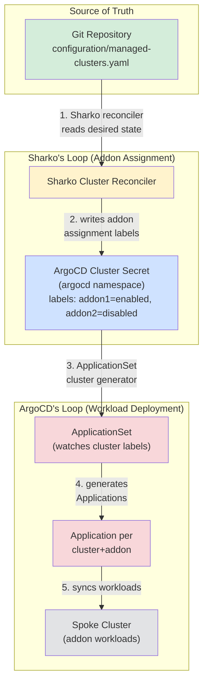

# Why Sharko, not just an ArgoCD Application?

If you already run ArgoCD for GitOps workload deployment, you might wonder: **Why run Sharko alongside ArgoCD? Won't I have two GitOps agents fighting over the same cluster?**

The short answer is **no** — Sharko and ArgoCD are complementary, not redundant. They run two distinct GitOps loops on different objects, driven by one Git source of truth. This page explains what Sharko actually does, how it fits alongside ArgoCD, and why you'd choose it over building the same thing yourself with ArgoCD ApplicationSets and External Secrets Operator.

## The two GitOps loops

Sharko and ArgoCD each own a different layer of the fleet-addon deployment flow. They never touch the same Kubernetes object.



### Sharko's loop

Git (`managed-clusters.yaml`) → Sharko's cluster reconciler → the **addon-assignment labels** on the ArgoCD cluster Secret (in the `argocd` namespace).

Those labels say which addons belong on which cluster. For example:

```yaml
metadata:
  labels:
    cert-manager: "enabled"
    datadog: "enabled"
    addon-datadog-version: "3.74.0"
```

Sharko writes these labels from Git. It never deploys workloads.

### ArgoCD's loop

Those labels → ApplicationSet cluster generator → Application resources → addon **workloads** on the spoke cluster.

ArgoCD reads the labels Sharko wrote and deploys the actual Helm charts. ArgoCD owns the spoke connection and all workload deployment. Sharko is a guest — it only writes labels.

## Guest-not-owner

Sharko never deploys workloads. It never creates ArgoCD Applications or ApplicationSets. It never manages the spoke cluster connection directly.

- **ArgoCD owns:** the connection to the spoke cluster (the cluster Secret's Data field — kubeconfig, CA, token), the workload-to-cluster sync, and the Application lifecycle.
- **Sharko owns:** the addon-assignment layer (which addons go where, as labels on the cluster Secret), the addon-secret injection for those addons, and the GitOps workflow for changing those assignments (preview-before-change, pull requests, audit trail).

If you remove Sharko, ArgoCD keeps running. Your workloads stay deployed. The ArgoCD ApplicationSets stop seeing new addon-assignment labels (because Sharko was the thing writing them from Git), but the existing Applications continue syncing. For a full teardown guide, see [If You Remove Sharko (no lock-in)](../operator/removing-sharko.md).

## The honest sell: your argocd-cluster-addons repo as a product

Many ArgoCD shops build a custom repository to manage fleet-wide addons in Git. That repo typically looks like:

- A `clusters` ArgoCD Application that reads a YAML file declaring which clusters exist and which addons belong on each one.
- An ApplicationSet with a matrix generator (clusters × addons) that deploys Helm charts based on label selectors.
- An External Secrets Operator (ESO) setup to fetch cluster credentials and addon secret values from AWS Secrets Manager or another backend.
- Custom conventions for naming, labeling, and structuring values files.

**Sharko is that repo turned into a product.** It delivers the same fleet-addon GitOps result — Git as truth, ArgoCD deploys the workloads — without you hand-building the bootstrap chart, the ApplicationSet matrix, the ESO wiring, or the label conventions. And it adds:

1. **UI + API + CLI** — no hand-editing YAML, no need to learn your custom repo layout.
2. **Catalog / marketplace** — browse and discover addons instead of knowing them by heart.
3. **Preview before every change** — "here's exactly what this PR will do" instead of reading a raw YAML diff.
4. **Review gate + audit trail** — every change is a PR with a human-readable summary and a recorded actor.
5. **Works without a secret store** — ESO is optional. Sharko can push encrypted secret values itself for teams that don't run ESO.
6. **Lower barrier** — a non-GitOps-expert can run a fleet.

## "Won't I have two GitOps agents fighting?"

No. One workload engine, one assignment controller, zero overlap:

- **ArgoCD deploys the actual addon workloads.** Sharko never deploys workloads.
- In a hand-built setup, the **`clusters` ArgoCD Application** (or equivalent) manages the assignment labels and ESO manifests. **Sharko replaces that one Application** with its own purpose-built controller — so it can add the UI, preview, audit, and the no-ESO-required option.

Same Git source of truth. Different jobs. No conflict.

## Why Sharko uses its own engine instead of an ArgoCD-app pattern

The ArgoCD cluster Secret is **one object** holding both the connection credentials (kubeconfig/token in `data`) and the addon-assignment labels (`metadata.labels`). Labels ride on the same Secret as the credentials — you can't split them.

For an ArgoCD Application to "deploy" that Secret, it needs the credential **values** at sync time. Putting credentials in Git is forbidden (plaintext secrets). So filling them requires one of exactly two things:

1. **External Secrets Operator (ESO)** — the Application deploys an `ExternalSecret` manifest; ESO fetches the value and writes the Secret (this is the pattern many shops use today).
2. **A CRD + controller** (operator mode) — the Application deploys a `SharkoClusterRegistration` custom resource; Sharko's controller reconciles it.

**Sharko does neither by design.** It dropped the ESO dependency (so teams without a secret store can still use it) and has no CRD yet (operator mode is roadmap, not v3.0.0). With no ESO and no CRD, an ArgoCD Application has **no Kubernetes resource to render** for cluster registration.

So Sharko runs its own process that writes the cluster Secret directly, using credentials it holds encrypted in its own config store. This is a design choice (self-contained, no hard dependency on ESO) that costs one trade-off: Sharko's desired state is not a kubectl-visible object today. For more on that transparency gap and the roadmap to close it, see the section below.

## What Sharko is not

- **Not a general-purpose GitOps rival to ArgoCD.** Sharko is a purpose-built controller for one narrow layer: cluster registration and addon-assignment labels. It never touches Applications or workloads.
- **Not a replacement for ArgoCD.** Sharko requires ArgoCD. It's built on top of ArgoCD's workload engine.
- **Not SaaS.** Sharko is a local install, like ArgoCD. You run it in your own cluster, with your own ArgoCD, as a guest.

## Transparency and the roadmap

Sharko's GitOps is **not 100% kubectl-transparent today.** When you run ArgoCD or ESO, you can `kubectl get application` or `kubectl get externalsecret` and see the desired state as a real Kubernetes object. Sharko reads a YAML file from Git, computes the desired cluster Secret in-memory, and writes it — the desired state never exists as an inspectable Kubernetes object.

This is a real trade-off. A skeptical platform engineer can't debug Sharko's desired state the way they debug ArgoCD or ESO. Status is visible via Sharko's UI, API, and Kubernetes events today — but not via a `kubectl get` command.

**The roadmap to close this gap:**

- **Near-term:** ESO integration (optional) — for teams that already run ESO, Sharko can emit `ExternalSecret` manifests instead of pushing secrets directly. This makes the secret-value path kubectl-visible.
- **Longer-term:** CRD + operator mode — Sharko's desired state becomes a real Kubernetes object (`kubectl get sharkoclusterassignment` shows desired state + status + errors). This is the full kubectl-native transparency model, analogous to how ArgoCD's `Application` resource works.

Neither gates v3.0.0. Today's transparency model (UI + API + events) is honest about what it is, and the roadmap items above are tracked in [Roadmap](../community/roadmap.md).

## Who is Sharko for?

Sharko is for ArgoCD users who **don't already have the hand-built setup.** If you're about to build an `argocd-cluster-addons` repository with ESO + ApplicationSets + custom conventions, Sharko gives you that result out of the box.

If you already run ESO + a clusters Application + ApplicationSets for 50+ clusters, you probably won't rip it out. The buyer is the team about to hand-build it.

## What's next

Once you understand the two-loop model, the rest of Sharko's documentation focuses on the practical workflows:

- [Managing Clusters](clusters.md) — registration, connection types, credentials
- [Managing Addons](addons.md) — enabling, upgrading, per-cluster values
- [Drift Detection and Sync](drift-and-sync.md) — how Sharko detects and optionally self-heals when someone edits the cluster Secret out of band
- [Operator Manual](../operator/installation.md) — installation, configuration, and production considerations
