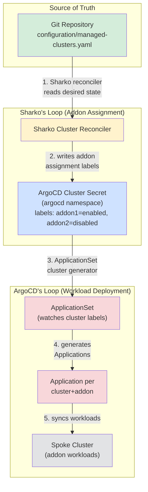

# Why Sharko, not just an ArgoCD Application?

If you already run ArgoCD for GitOps workload deployment, you might wonder: **Why run Sharko alongside ArgoCD? Won't I have two GitOps agents fighting over the same cluster?**

The short answer is **no** — Sharko and ArgoCD are complementary, not redundant. They run two distinct GitOps loops on different objects, driven by one Git source of truth. This page explains what Sharko actually does, how it fits alongside ArgoCD, and why you'd choose it over building the same thing yourself with ArgoCD ApplicationSets and External Secrets Operator.

For a look at how Sharko compares to specific tool categories — GitOps promoters, secret-delivery tools, cluster-fleet managers — see [Sharko vs. the Alternatives](comparison.md).

## The engine is Sharko's, the repo is yours

Sharko's deploy logic — the part that turns "which addons go where" into real ArgoCD `ApplicationSet`s — is not scattered across scripts or something you hand-maintain. It's one thing: [`sharko-engine`](https://github.com/MoranWeissman/sharko/tree/main/charts/sharko-engine), a versioned, signed Helm chart published to the same OCI registry as the Sharko server image. Your repo pins one version of it in `sharko-engine.yaml`. When Sharko ships new deploy logic, you review and merge a small pin-bump pull request — you never run a live migration to get it.

Everything else in your repo is data, not code: `catalog.yaml` lists the addons your org has approved, `cluster-addons/<cluster-name>.yaml` says which of those addons run on which cluster, and a `values/` folder holds the Helm values layered on top. None of these files carry template logic — that's what the engine chart is for. Your repo, Sharko's format: you can read it any time, but you write to it through Sharko.

Three doors lead to the same pipeline: the UI, for a person clicking through a change; the REST API, for a portal, a pipeline, or a tool like Backstage acting on someone's behalf; and the CLI, which wraps that same API. Whichever door you use, every write does the same three things — validate the change, show a preview, then open a Git pull request. **Sharko proposes, ArgoCD enforces:** Sharko doesn't deploy workloads — ArgoCD does that, by syncing from Git. Sharko does manage the ArgoCD connection Secret and addon secrets on the cluster; it writes those directly, while everything else goes through Git first.

## The two GitOps loops

Sharko and ArgoCD each own a different layer of the fleet-addon deployment flow. They never touch the same Kubernetes object.


```mermaid
flowchart TB
    subgraph "Source of Truth"
        Git["Git Repository<br/>configuration/managed-clusters.yaml"]
    end
    
    subgraph "Sharko's Loop (Addon Assignment)"
        Git -->|"1. Sharko reconciler<br/>reads desired state"| Recon["Sharko Cluster Reconciler"]
        Recon -->|"2. writes addon<br/>assignment labels"| ArgoSecret["ArgoCD Cluster Secret<br/>(argocd namespace)<br/>labels: addon1=enabled, addon2=disabled"]
    end
    
    subgraph "ArgoCD's Loop (Workload Deployment)"
        ArgoSecret -->|"3. ApplicationSet<br/>cluster generator"| AppSet["ApplicationSet<br/>(watches cluster labels)"]
        AppSet -->|"4. generates<br/>Applications"| Apps["Application per<br/>cluster+addon"]
        Apps -->|"5. syncs workloads"| Spoke["Spoke Cluster<br/>(addon workloads)"]
    end
    
    style Git fill:#d4edda
    style Recon fill:#fff3cd
    style ArgoSecret fill:#cfe2ff
    style AppSet fill:#f8d7da
    style Apps fill:#f8d7da
    style Spoke fill:#e2e3e5
```

### Sharko's loop

Git (`managed-clusters.yaml`) → the part of Sharko that keeps cluster connections in step with Git → the **addon-assignment labels** on the ArgoCD cluster Secret (in the `argocd` namespace).

Those labels say which addons belong on which cluster. For example:

```yaml
metadata:
  labels:
    cert-manager: "enabled"
    datadog: "enabled"
    addon-datadog-version: "3.74.0"
```

Sharko writes these labels from Git. It never deploys workloads.

### ArgoCD's loop

Those labels → ApplicationSet cluster generator → Application resources → addon **workloads** on the spoke cluster.

ArgoCD reads the labels Sharko wrote and deploys the actual Helm charts. ArgoCD owns the spoke connection and all workload deployment. Sharko is a guest — it only writes labels.

## Guest-not-owner

Sharko never deploys workloads. It never creates ArgoCD Applications or ApplicationSets. It never manages the spoke cluster connection directly.

- **ArgoCD owns:** the connection to the spoke cluster (the cluster Secret's Data field — kubeconfig, CA, token), the workload-to-cluster sync, and the Application lifecycle.
- **Sharko owns:** the addon-assignment layer (which addons go where, as labels on the cluster Secret), the addon-secret injection for those addons, and the GitOps workflow for changing those assignments (preview-before-change, pull requests, and an in-memory activity history of what Sharko did).

If you remove Sharko, ArgoCD keeps running. Your workloads stay deployed. The ArgoCD ApplicationSets stop seeing new addon-assignment labels (because Sharko was the thing writing them from Git), but the existing Applications continue syncing. For a full teardown guide, see [If You Remove Sharko (no lock-in)](../operator/removing-sharko.md).

## The honest sell: your argocd-cluster-addons repo as a product

Many ArgoCD shops build a custom repository to manage fleet-wide addons in Git. That repo typically looks like:

- A `clusters` ArgoCD Application that reads a YAML file declaring which clusters exist and which addons belong on each one.
- An ApplicationSet with a matrix generator (clusters × addons) that deploys Helm charts based on label selectors.
- An External Secrets Operator (ESO) setup to fetch cluster credentials and addon secret values from AWS Secrets Manager or another backend.
- Custom conventions for naming, labeling, and structuring values files.

**Sharko is that repo turned into a product.** It delivers the same fleet-addon GitOps result — Git as truth, ArgoCD deploys the workloads — without you hand-building the bootstrap chart, the ApplicationSet matrix, the ESO wiring, or the label conventions. And it adds:

1. **UI + API + CLI** — no hand-editing YAML, no need to learn your custom repo layout.
2. **Catalog / marketplace** — browse and discover addons instead of knowing them by heart.
3. **Preview before every change** — "here's exactly what this PR will do" instead of reading a raw YAML diff.
4. **Review gate + reviewable Git/PR history** — every change is a pull request with a human-readable summary and a recorded actor.
5. **Works without a secret store** — ESO is optional. Sharko can push encrypted secret values itself for teams that don't run ESO.
6. **Lower barrier** — a non-GitOps-expert can run a fleet.

## "Won't I have two GitOps agents fighting?"

No. One workload engine, one assignment controller, zero overlap:

- **ArgoCD deploys the actual addon workloads.** Sharko never deploys workloads.
- In a hand-built setup, the **`clusters` ArgoCD Application** (or equivalent) manages the assignment labels and ESO manifests. **Sharko replaces that one Application** with its own purpose-built controller — so it can add the UI, preview, audit, and the no-ESO-required option.

Same Git source of truth. Different jobs. No conflict.

## Why Sharko uses its own engine instead of an ArgoCD-app pattern

The ArgoCD cluster Secret is **one object** holding both the connection credentials (kubeconfig/token in `data`) and the addon-assignment labels (`metadata.labels`). Labels ride on the same Secret as the credentials — you can't split them.

For an ArgoCD Application to "deploy" that Secret, it needs the credential **values** at sync time. Putting credentials in Git is forbidden (plaintext secrets). So filling them requires one of exactly two things:

1. **External Secrets Operator (ESO)** — the Application deploys an `ExternalSecret` manifest; ESO fetches the value and writes the Secret (this is the pattern many shops use today).
2. **A CRD + controller** (operator mode) — the Application deploys a `SharkoClusterRegistration` custom resource; Sharko's controller reconciles it.

**Sharko does neither by design.** It dropped the ESO dependency (so teams without a secret store can still use it), and it has no CRD — an earlier CRD-based build was tried and shelved (see below); there's no plan to bring it back. With no ESO and no CRD, an ArgoCD Application has **no Kubernetes resource to render** for cluster registration.

So Sharko runs its own process that writes the cluster Secret directly, using credentials it holds encrypted in its own config store. This is a design choice (self-contained, no hard dependency on ESO) that costs one trade-off: Sharko's desired state is not a kubectl-visible object today. For more on that transparency gap and the roadmap to close it, see the section below.

## Why do Sharko's files look like Kubernetes resources — and why isn't Sharko an operator?

Open `catalog.yaml` or `cluster-addons/prod-eu.yaml` in your repo and the first
two lines look like a Kubernetes object: `apiVersion: sharko.dev/v1` and
`kind: AddonCatalog`. There is no `AddonCatalog` custom resource, and
`kubectl get addoncatalog` will never work. So why the Kubernetes-looking
header?

**The true story: Sharko tried being an operator, and shelved it.** An
earlier build (a `ClusterAddons` CRD, a controller, RBAC, a values-driven
Helm chart) went through several build phases and actually worked. It was
removed from the product before v4 shipped — the code still exists, kept
on a branch (`operator-shelf`), but it does not run. The reason: an
operator's desired state lives in a `CustomResource` that Kubernetes
stores — but Sharko's real desired state (which addons, at which
versions, on which clusters) is something a person reviews and approves
in a pull request, and Kubernetes objects are not the natural place to
put something you want reviewed before it takes effect. Git already is
that place. So the plain sentence for what Sharko actually is: **Sharko
is an operator whose desired state lives in Git, not in a CustomResource.**
The loop that keeps everything in step is real (the part of Sharko that
manages cluster connections, and the ApplicationSet generators) — only the "state lives in a CRD" part was tried and dropped.

**So why keep the Kubernetes-looking header at all, if there's no CRD
behind it?** Because the header answers a real question even without a
CRD: *what kind of file is this, and which version of its shape am I
reading?* `apiVersion` gives you the format version. `kind` gives you the
file's purpose without opening it. Several tools you already know do
exactly this for files nobody applies with `kubectl` — `kustomization.yaml`
(kustomize), `kind`'s own cluster-config file, `kubeadm`'s config file, and
Skaffold's `skaffold.yaml` all carry `apiVersion` + `kind` at the top,
with the rest of the fields sitting directly underneath — no `metadata:`,
no `spec:` wrapper. Sharko follows that same convention, on purpose,
because `metadata:` and `spec:` are the signal of a real applied resource,
and none of Sharko's data files are one.

**The one exception is `sharko-engine.yaml`.** That file *is* a real, applied
Kubernetes object — an ArgoCD `Application` — so it keeps the full
`apiVersion` / `kind` / `metadata` / `spec` shape a real manifest needs.
Every other Sharko-read file (`catalog.yaml`, `managed-clusters.yaml`,
`cluster-addons/<name>.yaml`) is header-plus-top-level-fields, exactly like
`kustomization.yaml`. One rule, one exception, and the exception is the
one file ArgoCD actually applies.

## What Sharko is not

- **Not a general-purpose GitOps rival to ArgoCD.** Sharko is a purpose-built controller for one narrow layer: cluster registration and addon-assignment labels. It never touches Applications or workloads.
- **Not a replacement for ArgoCD.** Sharko requires ArgoCD. It's built on top of ArgoCD's workload engine.
- **Not SaaS.** Sharko is a local install, like ArgoCD. You run it in your own cluster, with your own ArgoCD, as a guest.

## Transparency and the roadmap

Sharko's GitOps is **not 100% kubectl-transparent today.** When you run ArgoCD or ESO, you can `kubectl get application` or `kubectl get externalsecret` and see the desired state as a real Kubernetes object. Sharko reads a YAML file from Git, computes the desired cluster Secret in-memory, and writes it — the desired state never exists as an inspectable Kubernetes object.

This is a real trade-off. A skeptical platform engineer can't debug Sharko's desired state the way they debug ArgoCD or ESO. Status is visible via Sharko's UI, API, and Kubernetes events today — but not via a `kubectl get` command.

**On the CRD idea specifically:** Sharko already tried this once — a
`ClusterAddons` CRD and controller were built and then shelved before v4
shipped, for the reasons in the FAQ above. The code still exists on a
branch, but it does not run in the product today, and there is no current
plan to bring it back. Git is Sharko's answer to "where does desired state
live," not a future custom resource.

**A near-term option that stays git-based:** ESO integration (optional) —
for teams that already run External Secrets Operator, Sharko could emit
`ExternalSecret` manifests instead of pushing secrets directly, which
would make the secret-*value* path kubectl-visible without touching how
the rest of desired state is stored. This is not built; it is tracked in
[Roadmap](../community/roadmap.md).

Today's transparency model (UI + API + events, plus a Git history you can
read yourself) is honest about what it is.

## Who is Sharko for?

Sharko is for ArgoCD users who **don't already have the hand-built setup.** If you're about to build an `argocd-cluster-addons` repository with ESO + ApplicationSets + custom conventions, Sharko gives you that result out of the box.

If you already run ESO + a clusters Application + ApplicationSets for 50+ clusters, you probably won't rip it out. The buyer is the team about to hand-build it.

## What's next

Once you understand the two-loop model, the rest of Sharko's documentation focuses on the practical workflows:

- [Managing Clusters](clusters.md) — registration, connection types, credentials
- [Managing Addons](addons.md) — enabling, upgrading, per-cluster values
- [Drift Detection and Sync](drift-and-sync.md) — how Sharko detects and optionally self-heals when someone edits the cluster Secret out of band
- [Operator Manual](../operator/installation.md) — installation, configuration, and production considerations
